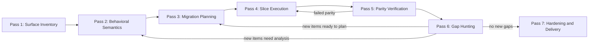

# Fractal Migration Agent — Revised Plan

## Goal

Design a manually-operated, depth-2 agent-as-function migration system for broadly scoped work such as migrating app X to framework Y while preserving business behavior 1:1.

The key architectural idea is:

**Each pass deepens the same shared graph of knowledge, planning, execution, and verification artifacts rather than starting from scratch.**

The system does not repeatedly "re-discover the app." It incrementally improves one evolving model of the application and the migration.

---

## Execution Model

**No orchestrator infrastructure.** Agents are static `.agent.md` files placed in a repository. The human operator runs them manually via Copilot CLI. There is no Ralph Orchestrator container lifecycle, no JIT template rendering, no MCP sidecar, no dynamic prompts.

**Human as scheduler.** The human decides which agent to run next, reads the orchestrator's routing decisions from `status.json`, and dispatches the next subagent. The human also decides when to terminate.

**Single repo workspace.** All agents, artifacts, and the target codebase live in the same repository workspace. Agents read and write files in a shared `.migration/` directory tree.

---

## Architecture Constraints

| Constraint | Decision | Rationale |
|---|---|---|
| Max depth | **2** (orchestrator → coordinator/worker) | Proven ceiling in Ralph families; no infrastructure for deeper nesting |
| Coordination substrate | **Files only** | No SQLite; depth-2 with human scheduling doesn't need a DB |
| Task selection | **Deterministic pass pipeline** | No frontier scoring; sequential passes with conditional re-entry |
| Convergence enforcement | **Human terminates** | No automated stop-forcing; human reads `progress.json` and decides |
| Dynamic prompts | **None** | Static `.agent.md` files; no Liquid rendering, no JIT |

---

## Core Position

### Architecture

Use a **deterministic pass pipeline with conditional re-entry**, operated by a human.

The orchestrator agent runs a 7-pass pipeline sequentially. After gap-hunting (Pass 6), the orchestrator reads `task-graph.json` for new entries. If new items exist, it routes back to Pass 2 or 3. The human dispatches each step.

### Coordination model

**Files only.** All coordination happens through JSON artifacts and `status.json` records in `.migration/`. No database, no queue manager, no locking. The human ensures one agent runs at a time.

### How iterative deepening works

Gap-hunting agents don't need a "growing skillset" — they need **growing input artifacts.** Pass 1's inventory is broad and shallow. After a full cycle, the inventory, behavior matrix, and verification matrix are all richer. Gap-hunter reads those richer artifacts and spots things that were invisible on the first pass. Each cycle, the evidence files are deeper, so gap-hunting gets sharper.

---

## System Principles

1. Every coordinator is a **pure router** — reads only child `status.json`, never child narrative artifacts.
2. Narrative outputs are first-class files: inspectable, diffable, versionable.
3. Progress is measured as **coverage convergence** via `progress.json`.
4. Playwright is a major progress oracle, but not the only oracle.
5. The most important artifact is the evolving **feature-and-behavior inventory** that defines what 1:1 actually means.
6. Knowledge retention happens through **versioned artifact files**, not dynamic skill generation.

---

## Success Model

Parity means agreement across multiple oracles, not HTML equality:

- User journey parity
- Screenshot similarity where useful
- API contract parity
- Validation behavior parity
- Authorization parity
- State transition parity
- Business-rule output parity
- Error-path parity
- Background job parity
- Reviewer assessment

---

## Pass Model

The passes deepen the same artifact graph instead of replacing it.

### Pass 1: Surface Inventory

Purpose: map the visible and structural surface area of the legacy system.

Outputs:
- `feature-inventory.json` — canonical feature list with confidence scores and unknowns
- Route map, UI flow map, API surface map, data model map
- Background job map, configuration map, feature clustering

This pass prefers breadth over precision.

### Pass 2: Behavioral Semantics Mapping

Purpose: deepen each discovered feature into behavior and invariants.

Outputs:
- `behavior-matrix.json` — behavioral semantics per feature
- `dependency-graph.json` — cross-feature dependencies
- State transition models, validation rules, error behaviors
- Authorization rules, side-effect map, async workflow map

This pass turns "what exists" into "what it actually does."

### Pass 3: Migration Planning

Purpose: transform the feature-and-behavior graph into an executable task graph.

Outputs:
- `task-graph.json` — dependency-ordered tasks with states
- Slice definitions, invariants per slice, acceptance criteria
- Blockers, rollback notes
- `risk-register.json`

The task graph should stay adaptive. New entries can be added by gap-hunting.

### Pass 4: Slice Execution

Purpose: migrate one bounded slice at a time.

A slice is: one workflow, one route family, one data boundary, one component cluster, or one subsystem seam.

Each slice runs through: coder → verifier → reviewer.

### Pass 5: Parity Verification

Purpose: test migrated slices against the old system from multiple angles.

Outputs:
- `verification-matrix.json` — per-slice results across all oracle types
- Journey parity reports, contract parity reports
- Visual regression reports, error-state parity reports

### Pass 6: Gap Hunting

Purpose: assume the migration is incomplete and try to prove it.

Gap hunters search for: unmapped features, hidden admin paths, feature flags, scheduled jobs, edge-case validations, non-happy-path regressions, missing error handling, silent contract changes.

**Re-entry rule:** If gap-hunter writes new items to `task-graph.json`, the orchestrator routes back to Pass 2 (if items need semantic analysis) or Pass 3 (if items can go straight to planning).

### Pass 7: Hardening and Delivery

Purpose: ensure the migrated system is actually ready.

Outputs: performance report, accessibility report, resilience report, observability readiness, rollback readiness, final handoff, decision log.

---

## Pass Flow



---

## Progress Model

| Metric | Description |
|---|---|
| Inventory coverage | % of features discovered vs estimated total |
| Semantic coverage | % of features with behavioral analysis |
| Planned coverage | % of features with migration tasks |
| Migrated coverage | % of slices with passing implementation |
| Verified coverage | % of slices passing parity verification |
| Unresolved-risk count | Open items in risk register |
| Parity confidence | Composite score across all oracle types |

All metrics are computed from artifact files. The human reads `progress.json` to decide when to stop.

---

## Knowledge Retention

Knowledge retention happens through **versioned artifact files**, not dynamic skill generation or SQLite indexes.

### How it works

1. **Pass-local findings** are written to the pass's output artifacts (e.g., `behavior-matrix.json` entries).
2. **Cross-pass knowledge** accumulates naturally: later passes read earlier artifacts. The behavior matrix from Pass 2 is input to Pass 3's planner. The verification matrix from Pass 5 is input to Pass 6's gap hunter.
3. **Iterative artifacts are versioned** when historical comparison matters: `feature-inventory-v1.json`, `feature-inventory-v2.json`, etc. This lets gap-hunting agents diff what changed between cycles.

No promotion ladder needed. The artifact graph IS the knowledge. Each cycle deepens it.

---

## Artifact Tree

All artifacts live under `.migration/` in the workspace.

```
.migration/
  progress.json                    — coverage metrics
  migration-manifest.json          — prepend-only audit log (newest first)
  feature-inventory.json           — canonical feature list
  behavior-matrix.json             — behavioral semantics per feature
  dependency-graph.json            — cross-feature dependencies
  task-graph.json                  — execution plan with task states
  risk-register.json               — open risks with severity
  verification-matrix.json         — per-slice results across oracles
  rollback-plan.json               — rollback steps per slice
  agents/
    <agent-name>/
      status.json                  — standard agent-as-function status
      output.md                    — narrative output
      output-v{N}.md               — versioned iterations
  slices/
    <slice-name>/
      status.json                  — slice execution status
      output.md                    — coder output
      review.md                    — reviewer output
      verification/                — per-oracle results
  history/
    feature-inventory-v{N}.json    — versioned snapshots for diffing
    behavior-matrix-v{N}.json
```

---

## Layered Agent Graph

### Layer 0: Session Orchestrator

One `.agent.md` file. The human runs it to get routing decisions. It reads child `status.json` files and the top-level artifact files (`progress.json`, `task-graph.json`) to determine which pass/agent to run next. It never reads narrative outputs.

Responsibilities:
- Determine current pass based on artifact state
- Output routing decision: which agent to dispatch next
- Update `progress.json` after each agent completes
- Detect re-entry conditions after gap-hunting

### Layer 1: Pass Coordinators (5 agents)

Each coordinator owns one pass. It reads its children's `status.json` records and dispatches the next specialist. In the depth-2 model, these coordinators dispatch leaf workers directly — no additional coordinator layer.

| Agent | Pass | Children |
|---|---|---|
| `discovery-coordinator` | 1 | feature-mapper, route-mapper, api-mapper, data-mapper, job-mapper, config-mapper |
| `planning-coordinator` | 2–3 | semantics-analyzer, dependency-analyzer, slice-planner, risk-analyzer |
| `execution-coordinator` | 4 | coder, reviewer, test-writer |
| `verification-coordinator` | 5–6 | journey-validator, contract-validator, parity-checker, gap-hunter |
| `delivery-coordinator` | 7 | hardening-checker, documentation-writer, handoff-writer |

### Layer 2: Specialist Workers (~25 agents)

Each specialist does one job, reads artifacts from `.migration/`, writes its `status.json` and output artifacts. No specialist dispatches other agents.

**Discovery specialists**
- `feature-mapper` — survey source code, routes, configs → update `feature-inventory.json`
- `route-mapper` — map all routes and navigation flows
- `api-mapper` — map API endpoints, contracts, payloads
- `data-mapper` — map data models, schemas, migrations
- `job-mapper` — map background jobs, scheduled tasks, workers
- `config-mapper` — map environment variables, feature flags, config files

**Planning specialists**
- `semantics-analyzer` — deepen features into behavioral invariants → update `behavior-matrix.json`
- `dependency-analyzer` — map cross-feature dependencies → update `dependency-graph.json`
- `slice-planner` — decompose work into ordered slices → update `task-graph.json`
- `risk-analyzer` — assess migration risks per slice → update `risk-register.json`

**Execution specialists**
- `coder` — implement one slice at a time
- `reviewer` — review coder output against slice spec and original behavior
- `test-writer` — write/migrate tests for a slice

**Verification specialists**
- `journey-validator` — run Playwright user journey comparisons
- `contract-validator` — diff API contracts, payload shapes, error codes
- `parity-checker` — cross-oracle parity assessment → update `verification-matrix.json`
- `gap-hunter` — adversarial search for uncovered features → write new `task-graph.json` entries

**Delivery specialists**
- `hardening-checker` — performance, resilience, accessibility checks
- `documentation-writer` — migration decisions, changelog, handoff notes
- `handoff-writer` — final summary and delivery report

---

## Agent Graph

```mermaid
flowchart TD
    SO[Session Orchestrator]

    SO --> DC[Discovery Coordinator]
    SO --> PC[Planning Coordinator]
    SO --> EC[Execution Coordinator]
    SO --> VC[Verification Coordinator]
    SO --> LC[Delivery Coordinator]

    DC --> FM[feature-mapper]
    DC --> RM[route-mapper]
    DC --> AM[api-mapper]
    DC --> DM[data-mapper]
    DC --> JM[job-mapper]
    DC --> CM[config-mapper]

    PC --> SA[semantics-analyzer]
    PC --> DA[dependency-analyzer]
    PC --> SP[slice-planner]
    PC --> RA[risk-analyzer]

    EC --> CO[coder]
    EC --> RV[reviewer]
    EC --> TW[test-writer]

    VC --> JV[journey-validator]
    VC --> CV[contract-validator]
    VC --> PK[parity-checker]
    VC --> GH[gap-hunter]

    LC --> HC[hardening-checker]
    LC --> DW[documentation-writer]
    LC --> HW[handoff-writer]

    AF[".migration/ artifact files"]

    DC -.reads/writes.-> AF
    PC -.reads/writes.-> AF
    EC -.reads/writes.-> AF
    VC -.reads/writes.-> AF
    LC -.reads/writes.-> AF
```



---

## Routing Model

| Result Code | Meaning |
|---|---|
| `mapped` | Surface mapping complete for this scope |
| `deepened` | Behavioral analysis complete |
| `planned` | Migration tasks generated |
| `implemented` | Code migration complete for slice |
| `partial` | Partial progress, more work needed |
| `verified` | All parity checks passing |
| `failed-parity` | One or more parity checks failed |
| `uncovered-gap` | New unmapped feature or behavior found |
| `blocked` | Upstream dependency preventing progress |
| `escalated` | Requires human decision |

Routing depends on `status.json` result codes only. Orchestrator and coordinators never read narrative output files.

---

## Re-entry Rules

| Condition | Action |
|---|---|
| Gap-hunter writes new items to `task-graph.json` needing analysis | Re-enter Pass 2 |
| Gap-hunter writes new items to `task-graph.json` ready to plan | Re-enter Pass 3 |
| Parity checker reports `failed-parity` for a slice | Re-enter Pass 4 for that slice |
| No new gaps found after Pass 6 | Proceed to Pass 7 |
| Human decides coverage is sufficient | Proceed to Pass 7 or terminate |

---

## Evaluation Criteria

The architecture should be auditable at any point:

- **Orchestrator purity:** Does the orchestrator read only `status.json`?
- **Artifact contract compliance:** Does every agent write proper `status.json` + output artifacts?
- **Routing correctness:** Do result codes match the routing table?
- **Coverage progress:** Is `progress.json` showing monotonic improvement across cycles?
- **Knowledge coherence:** Are later-pass artifacts consistent with earlier-pass artifacts?

---

## Decisions Log

| Decision | Rationale |
|---|---|
| Depth-2 max | All proven Ralph families are depth-1; depth-2 is already a stretch |
| ~30 agents total | 70+ is untested; 1 orchestrator + 5 coordinators + ~25 workers is more realistic |
| No SQLite | Human scheduling + file artifacts sufficient at depth-2 |
| No frontier scoring | Deterministic pass pipeline with re-entry covers iterative deepening |
| No automated convergence | Human reads progress, human terminates |
| No dynamic prompts | Static `.agent.md` files, manually placed, run via Copilot CLI |
| No Ralph Orchestrator | No containers, no JIT rendering, no MCP sidecar — just files and CLI |
| Files over history snapshots | Cycle metadata on entries sufficient; gap-hunter searches for omissions, not diffs |
| Convergence = gap-hunter output → 0 | No estimated feature totals; denominator is unknowable |
| Anti-laziness via prompt rules | Schemas support enforcement, prompts enforce it |

---

## Creation Phases

Each phase is self-contained: write the agents, run them, verify their output before moving on. Later phases depend on earlier phases' artifacts.

### Phase 0: Scaffold

**Create:** Directory structure + empty/seed artifact files.

| Artifact | Action |
|---|---|
| `.migration/` directory tree | Create all directories: `agents/`, `slices/` |
| `progress.json` | Seed with all counts at 0, all passes `not-started` |
| `migration-manifest.json` | Seed as empty array `[]` |
| All other JSON artifacts | Do NOT create — agents create them on first write |

**Verify:** Directory exists, `progress.json` is valid JSON.

**Agents to write:** None. This is manual setup (or a single `bootstrap.sh` script).

---

### Phase 1: Session Orchestrator

**Create:** `session-orchestrator.agent.md`

This is the top-level router. It reads child coordinator `status.json` files and `progress.json` to decide which coordinator to dispatch next.

**Prompt must include:**
- The full pass model (7 passes with dependencies)
- The routing table (result code → action)
- Re-entry rules
- How to update `progress.json` from artifact file counts
- The rule: read ONLY `status.json` files, never narrative output

**Dependencies:** None — this is the root.

**Verify:** Run the orchestrator against a seeded `.migration/` with some fake `status.json` files. It should output correct routing decisions.

**Files:**
- `session-orchestrator.agent.md`

---

### Phase 2: Discovery Agents

**Create:** `discovery-coordinator.agent.md` + 6 discovery specialists.

The coordinator dispatches mappers one at a time (or in parallel if the CLI supports it). Each mapper reads the legacy codebase and writes to its domain section of `feature-inventory.json`.

| Agent | Domain Key | What It Reads | What It Writes |
|---|---|---|---|
| `feature-mapper` | `ui` | Source code (components, pages, views) | UI features → `feature-inventory.json[ui]` |
| `route-mapper` | `routes` | Router configs, navigation files | Routes, flows → `feature-inventory.json[routes]` |
| `api-mapper` | `api` | API handlers, controllers, OpenAPI specs | Endpoints, contracts → `feature-inventory.json[api]` |
| `data-mapper` | `data` | Models, schemas, migrations, ORMs | Data models → `feature-inventory.json[data]` |
| `job-mapper` | `jobs` | Job queues, cron configs, workers | Background jobs → `feature-inventory.json[jobs]` |
| `config-mapper` | `config` | Env files, feature flags, config readers | Config surface → `feature-inventory.json[config]` |

**Each specialist prompt must include:**
- Its domain key and the read-modify-write rule (read file, update own section, preserve others)
- The `feature-inventory.json` schema (at minimum the feature entry structure)
- Feature ID assignment rule: check existing IDs, assign next available `F-NNN`
- `confidence` scoring guidelines (0.0–1.0)
- `unknowns` — must list anything uncertain rather than guessing
- The standard artifact contract (status.json + manifest.json prepend (newest first))

**Coordinator prompt must include:**
- List of 6 children with their domain keys
- Routing: dispatch each child, wait for `status.json`, proceed to next
- Completion: when all 6 report `mapped`, write own `status.json` with `result: mapped`
- Validation: check that `feature-inventory.json` has entries in all 6 domain keys

**Verify:** Run against the target legacy codebase. Check:
- `feature-inventory.json` has entries in all 6 domain sections
- Feature IDs are unique
- Every feature has `confidence` > 0 and non-empty `source.files`
- `summary.totalFeatures` matches entry count
- All 6 specialists wrote `status.json` with `result: mapped`
- `migration-manifest.json` has 6 entries

**Files (8 total):**
- `discovery-coordinator.agent.md`
- `feature-mapper.agent.md`
- `route-mapper.agent.md`
- `api-mapper.agent.md`
- `data-mapper.agent.md`
- `job-mapper.agent.md`
- `config-mapper.agent.md`

---

### Phase 3: Semantics Agents

**Create:** `planning-coordinator.agent.md` + `semantics-analyzer.agent.md` + `dependency-analyzer.agent.md`

The planning coordinator handles Pass 2 (semantics) and Pass 3 (planning). In this phase, only the Pass 2 specialists are built.

| Agent | Reads | Writes |
|---|---|---|
| `semantics-analyzer` | `feature-inventory.json` + source code | `behavior-matrix.json` |
| `dependency-analyzer` | `feature-inventory.json` + source code | `dependency-graph.json` |

**semantics-analyzer prompt must include:**
- The `behavior-matrix.json` schema
- For each feature in the inventory: extract state transitions, validation rules, auth rules, error paths, async behavior, invariants
- The invariants field is the most critical — these drive slice acceptance criteria downstream
- Must update feature `status` to `analyzed` in `feature-inventory.json` after processing
- `confidence` updates — raise or lower based on analysis certainty

**dependency-analyzer prompt must include:**
- The `dependency-graph.json` schema
- Edge type definitions: `depends-on`, `uses`, `shares-data`, `shares-ui`
- Cluster identification rules: features that share enough edges to form a natural migration unit
- Must update `dependencies` array on features in `feature-inventory.json`

**Coordinator prompt:**
- Dispatch semantics-analyzer first (behavior matrix needed for dependency analysis)
- Then dispatch dependency-analyzer
- Completion: both report `deepened`, coordinator writes `result: deepened`

**Verify:**
- Every feature with `status: analyzed` has a `behavior-matrix.json` entry
- Every behavior-matrix entry has at least one invariant
- `dependency-graph.json` has edges for features with cross-references
- Clusters are reasonable (not one giant cluster, not all singletons)

**Files (3 total):**
- `planning-coordinator.agent.md` (handles Pass 2 AND Pass 3 — built now, extended in Phase 4)
- `semantics-analyzer.agent.md`
- `dependency-analyzer.agent.md`

---

### Phase 4: Planning Agents

**Create:** `slice-planner.agent.md` + `risk-analyzer.agent.md`

These complete Pass 3 under the planning coordinator.

| Agent | Reads | Writes |
|---|---|---|
| `slice-planner` | `feature-inventory.json` + `behavior-matrix.json` + `dependency-graph.json` | `task-graph.json` + `rollback-plan.json` |
| `risk-analyzer` | `task-graph.json` + `behavior-matrix.json` | `risk-register.json` |

**slice-planner prompt must include:**
- The `task-graph.json` schema — this is the critical document
- Dependency ordering rule: slice A in `dependsOn` of slice B → A appears before B in the array
- Slice decomposition guidelines: use clusters from dependency-graph as starting candidates, split if too large
- Must inline `invariants` from behavior-matrix into each slice
- Must define `scope.sourceFiles` (what to touch) AND `scope.boundaryNotes` (what NOT to touch)
- Must declare `verificationOracles` per slice
- Must write `rollback-plan.json` entries for each slice

**risk-analyzer prompt must include:**
- `risk-register.json` schema
- Risk categories and severity levels
- Must check each slice for: behavioral risks (invariants that are hard to preserve), data risks (schema changes), integration risks (cross-system boundaries), performance risks (hot paths), security risks (auth changes)

**Coordinator:** extend the planning-coordinator prompt to include Pass 3 routing — dispatch slice-planner after Pass 2 completes, then risk-analyzer.

**Verify:**
- `task-graph.json` slices are dependency-ordered (no forward references in `dependsOn`)
- Every slice has `invariants` copied from behavior-matrix
- Every slice has `scope.boundaryNotes`
- Every feature with `status: analyzed` maps to at least one slice
- `rollback-plan.json` has an entry for every slice
- `risk-register.json` has at least one risk per slice (if none found, the analyzer is being lazy)

**Files (2 new, 1 updated):**
- `slice-planner.agent.md`
- `risk-analyzer.agent.md`
- Update `planning-coordinator.agent.md` with Pass 3 routing

---

### Phase 5: Execution Agents

**Create:** `execution-coordinator.agent.md` + `coder.agent.md` + `reviewer.agent.md` + `test-writer.agent.md`

This is the core migration loop. For each slice (in task-graph order):

```
coder → reviewer → [if rejected, coder again] → test-writer → [proceed to inline verification]
```

| Agent | Reads | Writes |
|---|---|---|
| `coder` | `task-graph.json` (next planned slice) + behavior-matrix + source code | Migrated code + `slices/<id>/output.md` |
| `reviewer` | Coder output + slice invariants + behavior-matrix | `slices/<id>/review.md` |
| `test-writer` | Coder output + behavior-matrix + slice spec | `slices/<id>/tests.md` + actual test files |

**coder prompt must include:**
- The dependency gate check: read `task-graph.json`, find next slice where `dependsOn` are all `verified`
- All boundary enforcement rules (scope.sourceFiles only, no cross-slice modifications, escalate if blocked)
- Must address every `invariant` in the slice — reviewer will reject otherwise
- Must address every `acceptanceCriteria` entry
- Sets slice status to `in-progress` then `implemented`

**reviewer prompt must include:**
- The anti-shortcut rules: check each invariant individually, check each acceptance criterion, check error paths
- Must reject if any invariant is unaddressed (write `result: rejected` with list of gaps)
- Must verify coder stayed within `scope.sourceFiles`
- No "looks good" reviews — must reference specific invariants and criteria

**test-writer prompt must include:**
- Must write tests for every invariant and error path in the slice
- Tests must be runnable (not pseudocode)
- Must cover happy paths AND every error path from behavior-matrix

**Coordinator:**
- Reads `task-graph.json` to find unfinished slices
- Dispatches coder → checks reviewer status → if rejected, re-dispatches coder → dispatches test-writer
- After test-writer completes, signals inline verification (Phase 6 agents) for this slice
- Loops until no `planned` slices remain

**Verify:**
- Pick a slice, check that `slices/<id>/output.md` addresses all invariants
- Review correctly maps invariant coverage
- Tests exist for error paths, not just happy paths
- Coder didn't touch files outside slice scope

**Files (4 total):**
- `execution-coordinator.agent.md`
- `coder.agent.md`
- `reviewer.agent.md`
- `test-writer.agent.md`

---

### Phase 6: Verification + Gap Hunting Agents

**Create:** `verification-coordinator.agent.md` + 4 verification specialists.

Verification runs inline (per-slice, after each execution cycle) and also as a batch gap-hunting pass.

| Agent | Reads | Writes |
|---|---|---|
| `journey-validator` | Migrated code + original behavior | `verification-matrix.json[slice][journey]` |
| `contract-validator` | API endpoints old vs new | `verification-matrix.json[slice][contract]` |
| `parity-checker` | All oracle results for a slice | `verification-matrix.json[slice][parity]` + slice `status` |
| `gap-hunter` | ALL `.migration/` artifacts + source code | New entries in `task-graph.json` + `feature-inventory.json` |

**journey-validator:** Runs Playwright comparisons of user flows. Must test the exact flows described in the slice's linked behavior-matrix entries.

**contract-validator:** Diffs API contracts (endpoints, payloads, status codes, error shapes). Must check every endpoint listed in the slice's features.

**parity-checker:** Aggregates oracle results. Sets slice status to `verified` only when ALL declared oracles pass. If any oracle is `fail`, sets `failed-parity`.

**gap-hunter prompt must include ALL anti-laziness rules.** This is the most adversarial agent:
- Must search for: hidden admin paths, feature flags, scheduled jobs, non-happy-path regressions, undocumented endpoints, implicit behaviors, race conditions, environment-dependent behavior
- Must compare feature-inventory against actual source code surface area
- Must check for features that exist in code but are NOT in the inventory
- New findings go to `task-graph.json` with incremented `cycle` and `addedInCycle`
- Also updates `feature-inventory.json` with new discoveries
- Convergence: if it finds nothing, writes `result: verified` (not `uncovered-gap`)

**Coordinator:**
- Inline mode: dispatches journey-validator + contract-validator for a specific slice, then parity-checker
- Gap-hunting mode: dispatches gap-hunter across full codebase
- Reports re-entry conditions to session orchestrator

**Verify:**
- `verification-matrix.json` has entries for completed slices
- Failed parity slices have specific failure reasons (not generic)
- Gap-hunter finds at least something on first pass (empty result on first run is suspicious)

**Files (5 total):**
- `verification-coordinator.agent.md`
- `journey-validator.agent.md`
- `contract-validator.agent.md`
- `parity-checker.agent.md`
- `gap-hunter.agent.md`

---

### Phase 7: Delivery Agents

**Create:** `delivery-coordinator.agent.md` + 3 delivery specialists.

Only reached when gap-hunter converges (0 new items) or human decides to proceed.

| Agent | Reads | Writes |
|---|---|---|
| `hardening-checker` | Verification-matrix + risk-register + migrated code | Hardening report |
| `documentation-writer` | All artifacts | Decision log, changelog, migration notes |
| `handoff-writer` | All artifacts | Final summary + delivery report |

These are the simplest agents — mostly reading + reporting. Lower risk of prompt issues.

**Verify:**
- Reports reference actual artifacts (not hallucinated)
- Open risks from risk-register are addressed or explicitly accepted
- Rollback plan is referenced and validated

**Files (4 total):**
- `delivery-coordinator.agent.md`
- `hardening-checker.agent.md`
- `documentation-writer.agent.md`
- `handoff-writer.agent.md`

---

### Phase Summary

| Phase | Agents | Cumulative | Pass Coverage | Can Test Independently |
|---|---|---|---|---|
| 0: Scaffold | 0 | 0 | — | Directory + seed files |
| 1: Orchestrator | 1 | 1 | Routing | With fake status.json files |
| 2: Discovery | 7 | 8 | Pass 1 | Against target codebase |
| 3: Semantics | 3 | 11 | Pass 2 | Against Phase 2 output |
| 4: Planning | 2 (+1 update) | 13 | Pass 3 | Against Phase 3 output |
| 5: Execution | 4 | 17 | Pass 4 | Against Phase 4 task-graph |
| 6: Verification | 5 | 22 | Pass 5–6 | Against Phase 5 output |
| 7: Delivery | 4 | 26 | Pass 7 | Against all artifacts |

**Total: 26 `.agent.md` files** (session orchestrator + 5 coordinators + 20 specialists).

Each phase bootstraps the next. Run Phase N, check its outputs, then Phase N+1's agents have real inputs to work with. Do not skip ahead — the agents depend on real artifact structure from previous phases.

## Resolved Questions

1. **Agent prompt size.** Not a concern. Each agent gets whatever prompt size it needs.
2. **Slice granularity.** The slice-planner agent is responsible for decomposing work into bite-sized pieces for the coder/reviewer loop. The plan does not prescribe slice size — the planner determines it based on the dependency graph and behavioral analysis.
3. **Cross-pass artifact schema.** Defined below.

---

## Artifact Schemas

### Design Decisions

- **Multi-writer inventory:** Single `feature-inventory.json` file, domain-keyed. Each discovery agent owns its domain key (`routes`, `api`, `data`, `jobs`, `config`, `ui`). Agents read-modify-write their own section only.
- **Slice assignment:** `task-graph.json` is dependency-ordered. The coder reads it and works through slices in order — picks the next slice where all `dependsOn` items are `verified`. No separate assignment mechanism needed — the ordering IS the assignment.
- **Verification:** Per-slice inline. Validators run after each slice's coder→reviewer cycle completes, before starting the next slice.

### Data Flow Summary

```
Pass 1: Discovery
  feature-mapper ──writes──→ feature-inventory.json[features]
  route-mapper   ──writes──→ feature-inventory.json[routes]
  api-mapper     ──writes──→ feature-inventory.json[api]
  data-mapper    ──writes──→ feature-inventory.json[data]
  job-mapper     ──writes──→ feature-inventory.json[jobs]
  config-mapper  ──writes──→ feature-inventory.json[config]

Pass 2: Semantics
  semantics-analyzer ──reads feature-inventory──→ writes behavior-matrix.json
  dependency-analyzer ──reads feature-inventory──→ writes dependency-graph.json

Pass 3: Planning
  slice-planner ──reads feature-inventory + behavior-matrix + dependency-graph──→ writes task-graph.json
  risk-analyzer ──reads task-graph + behavior-matrix──→ writes risk-register.json

Pass 4–5: Execution + Inline Verification (per slice, in dependency order)
  coder          ──reads task-graph[next planned]──→ writes slice code + slice status
  reviewer       ──reads coder output──→ writes review
  test-writer    ──reads coder output + behavior-matrix──→ writes tests
  journey-validator   ──reads slice──→ writes verification-matrix.json[slice][journey]
  contract-validator  ──reads slice──→ writes verification-matrix.json[slice][contract]
  parity-checker      ──reads verification-matrix[slice]──→ writes verification-matrix.json[slice][parity]

Pass 6: Gap Hunting
  gap-hunter ──reads ALL artifacts──→ appends to task-graph.json + feature-inventory.json

Pass 7: Delivery
  hardening-checker    ──reads verification-matrix + risk-register──→ writes hardening report
  documentation-writer ──reads ALL artifacts──→ writes decision log + changelog
  handoff-writer       ──reads ALL artifacts──→ writes final handoff
```

### `status.json` — Per-Agent Status (standard contract)

Every agent writes this. Orchestrator and coordinators read ONLY this for routing.

```json
{
  "agent": "feature-mapper",
  "task_id": "migration-001",
  "status": "completed",
  "result": "mapped",
  "summary": "Mapped 47 UI features across 12 routes",
  "artifacts": ["feature-mapper/output.md"],
  "next_hint": "route-mapper",
  "iteration": 1
}
```

| Field | Type | Values |
|---|---|---|
| `status` | string | `completed`, `failed`, `blocked` |
| `result` | string | `mapped`, `deepened`, `planned`, `implemented`, `partial`, `verified`, `failed-parity`, `uncovered-gap`, `blocked`, `escalated` |
| `summary` | string | Max ~100 tokens. Routing data only. |
| `artifacts` | string[] | Relative paths from `.migration/agents/` |
| `next_hint` | string \| null | Suggested next agent |
| `iteration` | number | Monotonically increasing dispatch count |

### `feature-inventory.json` — Canonical Feature Registry

The single source of truth for "what exists in the legacy system." Domain-keyed — each discovery agent owns its section.

```json
{
  "version": 1,
  "lastUpdated": "2026-03-12T14:30:00Z",
  "summary": {
    "totalFeatures": 142,
    "byStatus": { "discovered": 89, "analyzed": 38, "migrated": 12, "verified": 3, "deferred": 0 }
  },
  "features": {
    "F-001": {
      "id": "F-001",
      "domain": "routes",
      "name": "User registration flow",
      "description": "Multi-step registration with email verification",
      "source": {
        "files": ["src/pages/register.tsx", "src/api/auth/register.ts"],
        "routes": ["/register", "/register/verify"],
        "entryPoints": ["RegisterPage component"]
      },
      "status": "discovered",
      "confidence": 0.8,
      "unknowns": ["Third-party OAuth providers not fully mapped"],
      "dependencies": ["F-012", "F-034"],
      "tags": ["auth", "user-facing", "critical-path"],
      "discoveredBy": "route-mapper",
      "discoveredAt": "2026-03-12T10:15:00Z",
      "lastUpdatedBy": "semantics-analyzer",
      "lastUpdatedAt": "2026-03-12T14:30:00Z"
    }
  },
  "domains": {
    "routes": {
      "owner": "route-mapper",
      "featureIds": ["F-001", "F-002", "F-003"]
    },
    "api": {
      "owner": "api-mapper",
      "featureIds": ["F-020", "F-021"]
    },
    "data": {
      "owner": "data-mapper",
      "featureIds": ["F-040", "F-041"]
    },
    "jobs": {
      "owner": "job-mapper",
      "featureIds": ["F-060"]
    },
    "config": {
      "owner": "config-mapper",
      "featureIds": ["F-080", "F-081"]
    },
    "ui": {
      "owner": "feature-mapper",
      "featureIds": ["F-100", "F-101"]
    }
  }
}
```

**Key rules:**
- Feature IDs are stable across passes (`F-NNN`). Once assigned, never changes.
- `status` progresses: `discovered` → `analyzed` → `planned` → `migrated` → `verified` | `deferred`
- `confidence` is 0.0–1.0. Discovery agents set initial confidence. Semantics-analyzer updates it after behavioral analysis.
- `dependencies` references other feature IDs. Populated by dependency-analyzer in Pass 2.
- `unknowns` is an array of strings. Gap-hunter can add to this.
- Each domain section in `domains` declares its owner agent and lists its feature IDs. Agents only modify features in their domain unless performing cross-domain operations (semantics-analyzer, gap-hunter).

### `behavior-matrix.json` — Behavioral Semantics Per Feature

Produced by semantics-analyzer (Pass 2). Keyed by feature ID from the inventory.

```json
{
  "version": 1,
  "lastUpdated": "2026-03-12T16:00:00Z",
  "features": {
    "F-001": {
      "featureId": "F-001",
      "stateTransitions": [
        {
          "from": "anonymous",
          "to": "pending-verification",
          "trigger": "POST /api/auth/register",
          "sideEffects": ["sends verification email", "creates user record with status=pending"]
        },
        {
          "from": "pending-verification",
          "to": "active",
          "trigger": "GET /register/verify?token=...",
          "sideEffects": ["updates user status", "triggers welcome email"]
        }
      ],
      "validationRules": [
        {
          "field": "email",
          "rules": ["required", "valid-email", "unique-in-users-table"],
          "errorBehavior": "Returns 422 with field-level errors"
        },
        {
          "field": "password",
          "rules": ["required", "min-length-8", "complexity-check"],
          "errorBehavior": "Returns 422 with field-level errors"
        }
      ],
      "authRules": {
        "requiredRole": "anonymous",
        "deniedBehavior": "Redirect to /dashboard if already authenticated"
      },
      "errorPaths": [
        "Duplicate email → 422 with 'email already registered'",
        "Expired verification token → redirect to /register with flash message",
        "Rate limit exceeded → 429"
      ],
      "asyncBehavior": [
        "Email sent via background job queue (job: SendVerificationEmail)",
        "Token expires after 24h (checked via cron job: ExpireVerificationTokens)"
      ],
      "invariants": [
        "User cannot log in until status=active",
        "Verification token is single-use",
        "Registration is idempotent for the same email within 5 minutes"
      ]
    }
  }
}
```

**Key rules:**
- Every feature in the inventory with `status >= analyzed` must have an entry here.
- `invariants` are the most valuable field — these are the behaviors the coder MUST preserve 1:1.
- `errorPaths` must capture non-happy-path behavior. Gap-hunter specifically checks for missing error paths.

### `dependency-graph.json` — Cross-Feature Dependencies

Produced by dependency-analyzer (Pass 2). Directed edges between feature IDs.

```json
{
  "version": 1,
  "lastUpdated": "2026-03-12T16:30:00Z",
  "nodes": {
    "F-001": { "name": "User registration flow", "domain": "routes" },
    "F-012": { "name": "Email service", "domain": "jobs" },
    "F-034": { "name": "User data model", "domain": "data" }
  },
  "edges": [
    {
      "from": "F-001",
      "to": "F-012",
      "type": "uses",
      "description": "Registration triggers verification email via email service"
    },
    {
      "from": "F-001",
      "to": "F-034",
      "type": "depends-on",
      "description": "Registration creates user record"
    }
  ],
  "clusters": [
    {
      "id": "CL-001",
      "name": "Authentication",
      "featureIds": ["F-001", "F-002", "F-003", "F-034"],
      "description": "All auth-related features forming a natural migration unit"
    }
  ]
}
```

**Edge types:** `depends-on` (must migrate first), `uses` (runtime dependency), `shares-data` (same data model), `shares-ui` (shared components).

**`clusters`** are natural migration units identified by the dependency-analyzer. The slice-planner uses these as candidates for slices.

### `task-graph.json` — Dependency-Ordered Execution Plan

**The central coordination artifact.** Produced by slice-planner (Pass 3). This is the queue the coder works through.

```json
{
  "version": 1,
  "lastUpdated": "2026-03-12T18:00:00Z",
  "cycle": 1,
  "slices": [
    {
      "id": "S-001",
      "name": "User data model migration",
      "description": "Migrate User, UserProfile, and UserPreferences models",
      "featureIds": ["F-034"],
      "dependsOn": [],
      "status": "planned",
      "assignee": null,
      "priority": 1,
      "scope": {
        "sourceFiles": ["src/models/user.ts", "src/models/user-profile.ts"],
        "targetPattern": "Prisma schema + repository pattern",
        "boundaryNotes": "Do not migrate auth logic — that is S-003"
      },
      "acceptanceCriteria": [
        "All User fields mapped to new schema",
        "Existing queries produce identical results",
        "Migration script handles existing data"
      ],
      "invariants": [
        "User.email uniqueness constraint preserved",
        "Soft-delete behavior preserved (deletedAt field)"
      ],
      "rollbackNotes": "Drop new tables, restore from backup",
      "verificationOracles": ["contract", "data-parity"],
      "addedBy": "slice-planner",
      "addedInCycle": 1
    },
    {
      "id": "S-002",
      "name": "Email service migration",
      "description": "Migrate email sending infrastructure",
      "featureIds": ["F-012"],
      "dependsOn": [],
      "status": "planned",
      "assignee": null,
      "priority": 2,
      "scope": {
        "sourceFiles": ["src/services/email.ts", "src/jobs/send-email.ts"],
        "targetPattern": "Same queue-based pattern, new framework adapters",
        "boundaryNotes": "Email templates are a separate slice S-005"
      },
      "acceptanceCriteria": [
        "All email types send successfully",
        "Queue processing works under load"
      ],
      "invariants": [
        "Emails are never sent twice for the same event",
        "Failed sends are retried 3 times with exponential backoff"
      ],
      "rollbackNotes": "Revert to old email service module",
      "verificationOracles": ["contract", "journey"],
      "addedBy": "slice-planner",
      "addedInCycle": 1
    },
    {
      "id": "S-003",
      "name": "User registration flow migration",
      "description": "Migrate the full registration + verification flow",
      "featureIds": ["F-001"],
      "dependsOn": ["S-001", "S-002"],
      "status": "planned",
      "assignee": null,
      "priority": 3,
      "scope": {
        "sourceFiles": ["src/pages/register.tsx", "src/api/auth/register.ts"],
        "targetPattern": "New framework route + API handler",
        "boundaryNotes": "Depends on user model (S-001) and email service (S-002)"
      },
      "acceptanceCriteria": [
        "Full registration flow works end-to-end",
        "All validation rules preserved",
        "Error states match original behavior"
      ],
      "invariants": [
        "User cannot log in until status=active",
        "Verification token is single-use",
        "Registration is idempotent for same email within 5 minutes"
      ],
      "rollbackNotes": "Remove new registration routes, restore old handlers",
      "verificationOracles": ["journey", "contract", "visual"],
      "addedBy": "slice-planner",
      "addedInCycle": 1
    }
  ]
}
```

**Critical design rules:**

1. **Dependency ordering is the execution order.** Slices are ordered so that `dependsOn` references always point to earlier slices. The coder works top-to-bottom.
2. **Status progression:** `planned` → `in-progress` → `implemented` → `verified` | `failed-parity`. The coder sets `in-progress` when starting, `implemented` when done. Validators set `verified` or `failed-parity`.
3. **`dependsOn` gate:** The coder skips any slice whose dependencies aren't `verified` yet.
4. **`cycle` tracks re-entry.** When gap-hunter adds new slices, it increments the cycle and sets `addedInCycle` on new entries.
5. **`invariants` are pulled from `behavior-matrix.json`.** The slice-planner copies relevant invariants so the coder has them inline.
6. **`verificationOracles`** declares which oracle types must pass for this slice.
7. **`scope.boundaryNotes`** explicitly says what is NOT in scope. Prevents coder drift.

### `risk-register.json` — Migration Risks

Produced by risk-analyzer (Pass 3), updated by gap-hunter (Pass 6).

```json
{
  "version": 1,
  "lastUpdated": "2026-03-12T18:30:00Z",
  "risks": [
    {
      "id": "R-001",
      "sliceId": "S-003",
      "featureIds": ["F-001"],
      "severity": "high",
      "category": "behavioral",
      "description": "Registration idempotency relies on a 5-minute race-condition window stored in Redis. New framework may not have identical Redis integration.",
      "mitigation": "Verify Redis TTL behavior in new framework before migrating registration flow",
      "status": "open",
      "addedBy": "risk-analyzer",
      "addedAt": "2026-03-12T18:30:00Z",
      "resolvedBy": null,
      "resolvedAt": null
    }
  ]
}
```

**Severity:** `critical`, `high`, `medium`, `low`.
**Category:** `behavioral`, `data-loss`, `performance`, `security`, `integration`, `unknown`.
**Status:** `open` → `mitigated` → `accepted` | `resolved`.

### `verification-matrix.json` — Per-Slice Verification Results

Updated by validators inline after each slice's coder/reviewer cycle.

```json
{
  "version": 1,
  "lastUpdated": "2026-03-12T20:00:00Z",
  "slices": {
    "S-001": {
      "sliceId": "S-001",
      "status": "verified",
      "lastVerifiedAt": "2026-03-12T20:00:00Z",
      "oracles": {
        "contract": {
          "status": "pass",
          "summary": "All API contracts match",
          "details": "contract-validator/S-001-contract.md",
          "checkedAt": "2026-03-12T19:45:00Z"
        },
        "data-parity": {
          "status": "pass",
          "summary": "Query results identical for 15/15 test cases",
          "details": "parity-checker/S-001-data.md",
          "checkedAt": "2026-03-12T19:50:00Z"
        }
      }
    },
    "S-003": {
      "sliceId": "S-003",
      "status": "failed-parity",
      "lastVerifiedAt": "2026-03-12T21:00:00Z",
      "oracles": {
        "journey": {
          "status": "fail",
          "summary": "Registration flow breaks at email verification step — redirect URL wrong",
          "details": "journey-validator/S-003-journey.md",
          "checkedAt": "2026-03-12T20:55:00Z"
        },
        "contract": {
          "status": "pass",
          "summary": "API contracts match",
          "details": "contract-validator/S-003-contract.md",
          "checkedAt": "2026-03-12T20:50:00Z"
        }
      }
    }
  }
}
```

**Oracle types:** `journey` (Playwright), `contract` (API diff), `visual` (screenshot), `data-parity` (query results), `auth-parity` (authorization), `error-parity` (error states).

**Slice-level `status`:** `verified` only when ALL declared oracles pass.

### `progress.json` — Convergence Tracker

Written by the session orchestrator. No estimated totals — the denominator is unknowable. The convergence signal is **gap-hunter finding nothing new.**

```json
{
  "version": 1,
  "lastUpdated": "2026-03-12T22:00:00Z",
  "cycle": 1,
  "counts": {
    "featuresDiscovered": 142,
    "featuresAnalyzed": 38,
    "slicesPlanned": 22,
    "slicesImplemented": 3,
    "slicesVerified": 2,
    "slicesFailedParity": 1,
    "slicesBlocked": 0,
    "openRisks": { "critical": 1, "high": 2, "medium": 2, "low": 0 }
  },
  "gapHunting": {
    "cyclesCompleted": 0,
    "newItemsLastCycle": null,
    "newItemsHistory": []
  },
  "passStatus": {
    "discovery": "completed",
    "semantics": "in-progress",
    "planning": "not-started",
    "execution": "not-started",
    "verification": "not-started",
    "gapHunting": "not-started",
    "delivery": "not-started"
  }
}
```

**Convergence signal:** `gapHunting.newItemsLastCycle === 0`. When gap-hunter completes a cycle and finds nothing new, the system is converging. The human reads this and decides whether to proceed to delivery or run another cycle.

`gapHunting.newItemsHistory` is an array of integers — one entry per cycle. Trend should be decreasing. If it's not, something is unstable.

### `migration-manifest.json` — Prepend-Only Audit Log (Newest First)

Every agent appends after writing `status.json`.

```json
[
  {
    "timestamp": "2026-03-12T10:15:00Z",
    "agent": "feature-mapper",
    "artifacts": ["feature-mapper/output.md"],
    "status": "completed",
    "result": "mapped",
    "iteration": 1
  }
]
```

### `rollback-plan.json` — Per-Slice Rollback Steps

Produced by slice-planner. Used by hardening-checker to verify rollback readiness.

```json
{
  "version": 1,
  "slices": {
    "S-001": {
      "steps": [
        "Drop new Prisma tables: User_new, UserProfile_new, UserPreferences_new",
        "Restore original model files from git",
        "Run original migration to restore schema"
      ],
      "dataBackupRequired": true,
      "estimatedImpact": "Users table temporarily unavailable during rollback"
    }
  }
}
```

### Artifact File Tree (revised)

```
.migration/
  progress.json
  migration-manifest.json
  feature-inventory.json
  behavior-matrix.json
  dependency-graph.json
  task-graph.json
  risk-register.json
  verification-matrix.json
  rollback-plan.json
  agents/
    <agent-name>/
      status.json
      output.md
      output-v{N}.md
  slices/
    <slice-id>/
      output.md              — coder narrative
      review.md              — reviewer output
      tests.md               — test-writer output
```

No `history/` directory. Cycle metadata on each entry (`addedInCycle`, `discoveredAt`, `addedBy`) is sufficient for gap-hunter to identify what's new. Gap-hunter reads current state and searches for what's NOT there — it doesn't need structural diffs.

---

## Prompt-Level Enforcement Rules

The schemas define what agents write. These rules define what agents MUST NOT skip. They go into the `.agent.md` prompts.

### Anti-Shortcut Rules (all verification and gap-hunting agents)

Every reviewer, validator, and gap-hunter prompt must include:

1. **No summarization of parity.** "The registration flow works" is not verification. The agent must test each invariant from the slice's `invariants` array individually and report pass/fail per invariant.
2. **No skipping error paths.** Every `errorPaths` entry in `behavior-matrix.json` for covered features must be verified. Marking a slice as `verified` with untested error paths is a failure.
3. **No assumed equivalence.** If the agent cannot *run* a check (e.g., no Playwright setup yet), the oracle status must be `skipped` with an explanation — never `pass`.
4. **Gap-hunter must be adversarial.** The gap-hunter's job is to assume the migration is wrong and prove it. It searches for: hidden admin routes, feature flags, scheduled jobs, non-happy-path regressions, undocumented API endpoints, implicit behaviors, race conditions, environment-dependent behavior. A gap-hunting pass that finds zero issues should be treated with suspicion, not celebration.
5. **Reviewer must reject incomplete invariant coverage.** If the coder's implementation doesn't address every invariant listed in the slice's task-graph entry, the reviewer must reject with a specific list of unaddressed invariants.

### Boundary Enforcement (coder)

1. **Coder must not touch files outside `scope.sourceFiles` and their direct target equivalents** unless a dependency requires it and the dependency is documented.
2. **Coder must not modify other slices' code.** If a fix requires touching another slice's scope, the coder writes an `escalated` status with details and stops.
3. **Coder must check `dependsOn` gate before starting.** If any dependency slice is not `verified`, the coder writes `blocked` status and stops.
