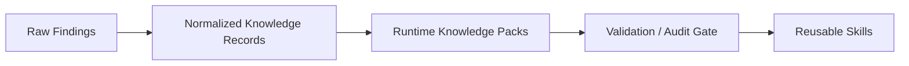

# Fractal Migration Agent Plan

## Goal

Design a long-running agent-as-function migration system for broadly scoped work such as migrating app X to framework Y while preserving business behavior 1:1.

The key architectural idea is:

**Each pass deepens the same shared graph of knowledge, planning, execution, and verification artifacts rather than starting from scratch.**

That means the system does not repeatedly "re-discover the app." It incrementally improves one evolving model of the application and the migration.

---

## Core Position

### Recommended architecture

Use a **hybrid frontier-based long-running session**.

The top-level orchestrator keeps one long-running session and manages a frontier of unresolved work. It repeatedly chooses the highest-value next item to deepen, plan, implement, or verify.

### Recommended coordination model

Use a **hybrid evidence-plane plus control-plane**.

- Use **files** for evidence, rich outputs, diffable reports, inventories, analyses, parity reports, screenshots, and other narrative artifacts.
- Use **SQLite or equivalent machine-readable storage** for task queues, ownership, frontier scores, retries, lifecycle state, and knowledge indexes.

### Why not SQLite-only

A SQLite-only design is attractive for coordination, but it is the wrong sole substrate.

**What SQLite is good at**
- Queue management
- Task ownership
- Frontier scoring
- Retry bookkeeping
- Deduplication
- Resumability
- Indexed lookups
- Knowledge indexing

**What SQLite is bad at**
- Rich subagent handoff
- Human-debuggable evidence
- Diffability
- Auditability of reasoning artifacts
- Preserving the clean agent-as-function contract
- Preventing coordinators from turning into arbitrary query engines

So the right answer is:

- **SQLite as control plane**
- **Artifacts as evidence plane**

The routing rule stays unchanged even with SQLite: coordinators should route on status records and approved machine-readable control data, not on child narrative outputs.

---

## System Principles

1. Every coordinator at layer 0, 1, or 2 is a **pure router for substantive work**.
2. No coordinator reads child narrative artifacts for routing.
3. Narrative outputs remain first-class files because they are inspectable and diffable.
4. Control state is separate from evidence.
5. Progress is measured as **coverage convergence**, not as a vague sense that "tests pass."
6. Playwright is a major progress oracle, but not the only oracle.
7. The most important artifact is not a test report; it is the evolving **feature-and-behavior inventory** that defines what 1:1 actually means.
8. Dynamic skill generation must be constrained by a promotion ladder, not allowed to mutate the system freely.

---

## Success Model

The system should not define parity as HTML equality or pixel-perfect DOM equivalence.

It should define parity as agreement across multiple oracles:

- User journey parity
- Screenshot similarity where useful
- API contract parity
- Validation behavior parity
- Authorization parity
- State transition parity
- Business-rule output parity
- Error-path parity
- Background job parity
- Reviewer assessment

---

## Pass Model

The passes deepen the same graph instead of replacing it.

### Pass 1: Surface Inventory

Purpose: map the visible and structural surface area of the legacy system.

Outputs include:
- Feature inventory
- Route map
- UI flow map
- API surface map
- Data model map
- Background job map
- Configuration and environment map
- Feature clustering

This pass prefers breadth over precision.

### Pass 2: Behavioral Semantics Mapping

Purpose: deepen each discovered feature into behavior and invariants.

Outputs include:
- Behavior matrix
- Dependency graph
- State transition models
- Validation rule inventory
- Error behavior inventory
- Authorization rule map
- Side-effect map
- Async workflow map

This pass turns "what exists" into "what it actually does."

### Pass 3: Migration Planning

Purpose: transform the feature-and-behavior graph into an executable task graph.

Outputs include:
- Dependency-ordered task graph
- Slice definitions
- Invariants per slice
- Acceptance criteria
- Blockers
- Rollback notes
- Risk register

This is not one frozen global plan. It should stay adaptive and frontier-driven.

### Pass 4: Slice Execution

Purpose: migrate one bounded slice at a time.

A slice should be something like:
- One workflow
- One route family
- One data boundary
- One component cluster
- One subsystem seam

Each slice should run through a bounded execution loop:
- Coder
- Local verifier
- Reviewer
- Specialized validators as needed

### Pass 5: Parity Verification

Purpose: test migrated slices against the old system from multiple angles.

Outputs include:
- Verification matrix
- Journey parity reports
- Contract parity reports
- Visual regression reports
- Error-state parity reports
- State transition checks

### Pass 6: Gap Hunting

Purpose: assume the migration is incomplete and try to prove it.

Gap hunters search for:
- Unmapped features
- Hidden admin paths
- Feature flags
- Scheduled jobs
- Edge-case validations
- Non-happy-path regressions
- Missing error handling
- Silent contract changes

This pass should be able to reopen planning and execution.

### Pass 7: Hardening and Delivery

Purpose: ensure the migrated system is actually ready.

Outputs include:
- Performance report
- Accessibility report
- Resilience report
- Observability readiness
- Rollback readiness
- Final handoff
- Decision log

---

## Progress Model

The orchestrator should report progress using coverage metrics, not intuition.

Recommended metrics:

| Metric | Description |
|---|---|
| Inventory coverage | % of features discovered vs estimated total |
| Semantic coverage | % of features with behavioral analysis |
| Planned coverage | % of features with migration tasks |
| Migrated coverage | % of slices with passing implementation |
| Verified coverage | % of slices passing parity verification |
| Unresolved-risk count | Open items in risk register |
| Blocker aging | Time since oldest unresolved blocker |
| Parity confidence | Composite score across all oracle types |

Playwright contributes heavily to verified coverage, but it should not dominate the score by itself.

---

## Dynamic Knowledge Retention

Yes, the system should retain knowledge across passes. But it should do so through a disciplined ladder.

### Promotion ladder

1. **Raw findings** — pass-local observations.
2. **Normalized knowledge records** — structured facts, invariants, mappings, and rules.
3. **Runtime knowledge packs** — temporary synthesized bundles for later passes in the same migration.
4. **Validated reusable skills** — only promoted after validation or audit.

That avoids prompt drift and prevents the system from turning every early guess into permanent doctrine.

---

## Shared Evidence Plane

The evidence plane should contain rich, durable, inspectable artifacts.

Recommended major artifacts:

| Artifact | Purpose |
|---|---|
| `migration-manifest.json` | Append-only audit log of all operations |
| `progress.json` | Real-time coverage metrics |
| `feature-inventory.json` | Canonical feature list with status per feature |
| `behavior-matrix.json` | Behavioral semantics per feature |
| `dependency-graph.json` | Cross-feature and cross-slice dependencies |
| `task-graph.json` | Execution plan with task states |
| `risk-register.json` | Open risks with severity and ownership |
| `verification-matrix.json` | Per-slice verification results across oracles |
| `rollback-plan.json` | Rollback steps per slice |
| Per-agent `status.json` | Standard agent-as-function status records |
| Per-agent `output.md` / `output-v{N}.md` | Narrative artifacts, versioned when iterative |

Iterative artifacts should be versioned when later passes may need historical comparisons.

---

## Shared Control Plane

The control plane should contain machine-readable lifecycle state.

Recommended responsibilities:

| Component | Purpose |
|---|---|
| Frontier queue | Ordered work items by priority |
| Task ownership | Which agent/coordinator owns which task |
| Retry counts | Per-task retry state |
| Priority scores | Computed frontier scores for selection |
| Dependency resolution | Which tasks are unblocked |
| Locking / claim state | Prevent double-execution |
| Knowledge registry | Index of discovered facts and invariants |
| Skill registry | Promoted runtime knowledge packs |
| Evaluation ledger | Audit trail for eval dimensions |

SQLite is a strong fit here.

---

## Layered Orchestrator Graph

### Layer 0: Session Orchestrator

Responsibilities:
- Own session lifecycle
- Select frontier items
- Enforce top-level stop conditions
- Route between major passes
- Maintain high-level convergence criteria

### Layer 1: Pass Coordinators

| Coordinator | Responsibility |
|---|---|
| Discovery Coordinator | Surface mapping and inventory |
| Planning Coordinator | Semantic deepening, decomposition, task-graph generation |
| Execution Coordinator | Implementation loops per slice |
| Verification Coordinator | Parity, adversarial checking, verification convergence |
| Delivery Coordinator | Hardening, handoff, release readiness |

### Layer 2: Specialist Coordinators

**Under Discovery Coordinator**
- Feature Inventory Coordinator
- Route Mapping Coordinator
- UI Flow Coordinator
- API Surface Coordinator
- Data Model Coordinator
- Background Jobs Coordinator
- Config / Environment Coordinator

**Under Planning Coordinator**
- Semantics Coordinator
- Dependency Coordinator
- Slice Planning Coordinator
- Risk Planning Coordinator
- Rollback Planning Coordinator

**Under Execution Coordinator**
- Slice Executor Coordinator
- Code Migration Coordinator
- UI Migration Coordinator
- Data Migration Coordinator
- Integration Migration Coordinator

**Under Verification Coordinator**
- Behavior Parity Coordinator
- Playwright Journey Coordinator
- Contract Parity Coordinator
- Visual Regression Coordinator
- Integration Verifier Coordinator
- Gap Hunting Coordinator
- Risk Audit Coordinator

**Under Delivery Coordinator**
- Hardening Coordinator
- Observability Coordinator
- Documentation Coordinator
- Handoff Coordinator

### Layer 3: Leaf Workers

**Under Discovery**
- Screen Mapper
- Route Leaf Mapper
- Endpoint Mapper
- Schema Mapper
- Job Mapper
- Feature Flag Mapper
- Dependency Edge Mapper

**Under Planning**
- State Transition Analyzer
- Validation Rules Analyzer
- Auth Rules Analyzer
- Side Effects Analyzer
- Slice Task Planner
- Blocker Classifier
- Rollback Step Planner

**Under Execution**
- Coder
- Refactorer
- Adapter Builder
- Test Migrator
- Fixture Builder
- Config Rewriter
- Migration Script Writer

**Under Verification**
- Journey Validator
- Screenshot Comparator
- Payload Diff Validator
- Error State Validator
- Auth Parity Validator
- Background Job Validator
- Accessibility Validator
- Gap Hunter
- Invariant Checker

**Under Delivery**
- Performance Checker
- Resilience Checker
- Telemetry Checker
- Rollback Readiness Checker
- Handoff Writer
- Decision Log Writer

---

## Cross-Cutting Components

### Control Plane Components

- Queue Manager
- Frontier Scorer
- Ownership Tracker
- Retry Manager
- Knowledge Registry
- Skill Registry
- Evaluation Ledger

### Evidence Plane Components

- Feature Inventory
- Behavior Matrix
- Dependency Graph
- Task Graph
- Verification Matrix
- Risk Register
- Rollback Plan
- Manifest
- Per-agent outputs
- Per-agent status records

---

## Routing Model

Each family of agents should use explicit result codes.

| Result Code | Meaning |
|---|---|
| `mapped` | Surface mapping complete for this scope |
| `deepened` | Behavioral analysis complete |
| `planned` | Migration tasks generated |
| `ready-for-execution` | All dependencies unblocked |
| `implemented` | Code migration complete for slice |
| `partial` | Partial progress, requeue needed |
| `verified` | All parity checks passing |
| `failed-parity` | One or more parity checks failed |
| `uncovered-gap` | New unmapped feature or behavior found |
| `blocked` | Upstream dependency preventing progress |
| `escalated` | Requires human or higher-authority decision |

Routing must always depend on status records and approved control data, not child narrative outputs.

---

## Convergence Model

The migration is complete only when all of the following are true:

1. No high-priority unknowns remain.
2. No required verification bundle is failing.
3. No mandatory slice is unplanned.
4. No mandatory slice is unimplemented.
5. No significant gap hunter finding remains unresolved.
6. Risk register is below the agreed threshold.
7. Rollback readiness is acceptable.
8. Delivery artifacts are complete.

---

## Evaluation Criteria

The architecture must be evaluable from the start.

It should be possible to audit:
- Orchestrator purity
- Artifact contract compliance
- Data-flow correctness
- Routing-table completeness
- Efficiency
- Tool ordering
- Retry behavior
- Validation coverage
- Knowledge-promotion discipline

---

## Critique Summary

### What works about this design

- A persistent coordination substrate is necessary.
- Dynamic retention of learned structure is necessary.
- Repeated full-pass rediscovery is wasteful.
- Broad migrations need a stronger internal state model than a pile of disconnected files.

### What does not work

- Replacing the artifact model with SQLite entirely.
- Letting the orchestrator or coordinators query arbitrary rich content from the database.
- Letting runtime observations become durable skills without a validation boundary.

The control plane idea is good. The "database as everything" idea is not.

---

## Diagrams

### Orchestrator Graph

```mermaid
flowchart TD
    SO[Layer 0: Session Orchestrator]

    SO --> D1[Layer 1: Discovery Coordinator]
    SO --> P1[Layer 1: Planning Coordinator]
    SO --> E1[Layer 1: Execution Coordinator]
    SO --> V1[Layer 1: Verification Coordinator]
    SO --> L1[Layer 1: Delivery Coordinator]

    D1 --> D2A[Feature Inventory Coordinator]
    D1 --> D2B[Route Mapping Coordinator]
    D1 --> D2C[UI Flow Coordinator]
    D1 --> D2D[API Surface Coordinator]
    D1 --> D2E[Data Model Coordinator]
    D1 --> D2F[Background Jobs Coordinator]
    D1 --> D2G[Config/Env Coordinator]

    D2A --> D3A[Screen Mapper]
    D2B --> D3B[Route Leaf Mapper]
    D2D --> D3C[Endpoint Mapper]
    D2E --> D3D[Schema Mapper]
    D2F --> D3E[Job Mapper]
    D2G --> D3F[Feature Flag Mapper]
    D2A --> D3G[Dependency Edge Mapper]

    P1 --> P2A[Semantics Coordinator]
    P1 --> P2B[Dependency Coordinator]
    P1 --> P2C[Slice Planning Coordinator]
    P1 --> P2D[Risk Planning Coordinator]
    P1 --> P2E[Rollback Planning Coordinator]

    P2A --> P3A[State Transition Analyzer]
    P2A --> P3B[Validation Rules Analyzer]
    P2A --> P3C[Auth Rules Analyzer]
    P2A --> P3D[Side Effects Analyzer]
    P2C --> P3E[Slice Task Planner]
    P2D --> P3F[Blocker Classifier]
    P2E --> P3G[Rollback Step Planner]

    E1 --> E2A[Slice Executor Coordinator]
    E1 --> E2B[Code Migration Coordinator]
    E1 --> E2C[UI Migration Coordinator]
    E1 --> E2D[Data Migration Coordinator]
    E1 --> E2E[Integration Migration Coordinator]

    E2A --> E3A[Coder]
    E2B --> E3B[Refactorer]
    E2B --> E3C[Adapter Builder]
    E2E --> E3D[Test Migrator]
    E2E --> E3E[Fixture Builder]
    E2C --> E3F[Config Rewriter]
    E2D --> E3G[Migration Script Writer]

    V1 --> V2A[Behavior Parity Coordinator]
    V1 --> V2B[Playwright Journey Coordinator]
    V1 --> V2C[Contract Parity Coordinator]
    V1 --> V2D[Visual Regression Coordinator]
    V1 --> V2E[Integration Verifier Coordinator]
    V1 --> V2F[Gap Hunting Coordinator]
    V1 --> V2G[Risk Audit Coordinator]

    V2B --> V3A[Journey Validator]
    V2D --> V3B[Screenshot Comparator]
    V2C --> V3C[Payload Diff Validator]
    V2A --> V3D[Error State Validator]
    V2A --> V3E[Auth Parity Validator]
    V2E --> V3F[Background Job Validator]
    V2A --> V3G[Accessibility Validator]
    V2F --> V3H[Gap Hunter]
    V2G --> V3I[Invariant Checker]

    L1 --> L2A[Hardening Coordinator]
    L1 --> L2B[Observability Coordinator]
    L1 --> L2C[Documentation Coordinator]
    L1 --> L2D[Handoff Coordinator]

    L2A --> L3A[Performance Checker]
    L2A --> L3B[Resilience Checker]
    L2B --> L3C[Telemetry Checker]
    L2A --> L3D[Rollback Readiness Checker]
    L2D --> L3E[Handoff Writer]
    L2D --> L3F[Decision Log Writer]

    CP[Control Plane: SQLite / machine-readable state]
    EP[Evidence Plane: files / rich artifacts]

    SO -.reads/writes.-> CP
    D1 -.reads/writes.-> CP
    P1 -.reads/writes.-> CP
    E1 -.reads/writes.-> CP
    V1 -.reads/writes.-> CP
    L1 -.reads/writes.-> CP

    D1 -.produces/deepens.-> EP
    P1 -.produces/deepens.-> EP
    E1 -.produces/deepens.-> EP
    V1 -.produces/deepens.-> EP
    L1 -.produces/deepens.-> EP
```

### Pass Flow Graph

### Knowledge Promotion Graph

