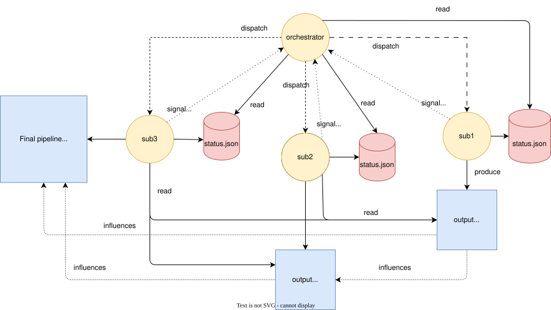
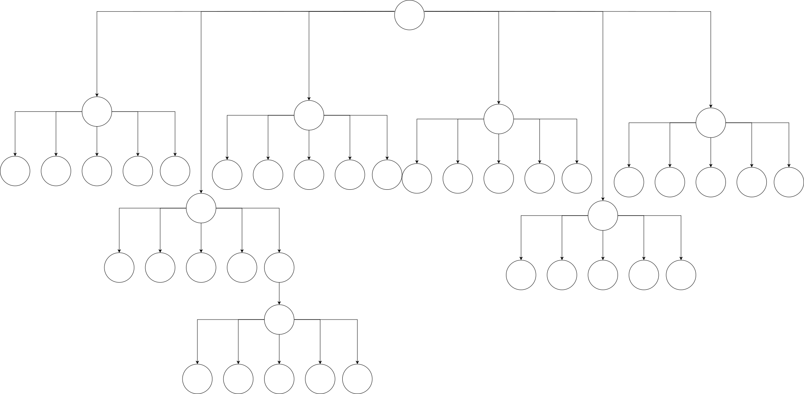

problem statement
# Coordination mechanisms for long-horizon, self-converging, autonomous LLM systems 

This repository describes and showcases a large language model (LLM) coordination architecture I use to manage long-horizon, self-converging, autonomous tasks.

But primarily, it is here for me to attempt to formalize and formulate some kind of a framework for my thoughts and observations resulting from experimenting with and staring at LLM outputs for likely way longer than healthy.

A couple of definitions to get started:

> By **long-horizon**, I mean tasks that cannot realistically be completed in one short, uninterrupted reasoning session. They take many tool calls, many intermediate decisions, often multiple phases, and usually some amount of re-evaluation of earlier work. The problem is not just that they are large. It is that they stay large over time, while the model's context keeps changing underneath them, with key information entering and exiting, and the overall system entropy increasing due to inherent constraints and limitation of the LLM architecture.

> By **self-convergence**, I mean that the workflow has an internal mechanism for recognizing that the current result is still not good enough, feeding that back into an earlier stage in its processing, and repeating until some stability condition is reached, or the system hits some explicit bound. In practice, this is usually not some abstract philosophical property, but a loop. For example, a planner produces tasks, execution implements it, verification rejects or flags gaps, and that rejection feeds a replanning pass instead of just becoming a dead-end error that ends the model's turn, prompting human intervention.

> And by **autonomous**, I mean just that. The human bootstraps the environment, prepares some artifacts to drive the workflow -- think task description, references, the final desired state, all that fluff. Then, following this setup, there is only an initial impulse fed into the architecture -- usually a simple *begin*, or *continue* -- after which the system is capable of independent work based on surrounding, self-managed context. It persists through transient API failures, crashes, timeouts, and is capable of resuming from any point without degrading its downstream state and resulting artifacts. It is not dependent on any single ephemeral, transient LLM context.

Table of contents:

- [Coordination mechanisms for long-horizon, self-converging, autonomous LLM systems](#coordination-mechanisms-for-long-horizon-self-converging-autonomous-llm-systems)
- [Primary constraints and assumptions](#primary-constraints-and-assumptions)
- [Problem area introduction](#problem-area-introduction)
  - [Key factors influencing the architecture](#key-factors-influencing-the-architecture)
    - [Harness](#harness)
    - [Context window](#context-window)
    - [Prompt "fragility"](#prompt-fragility)
  - [Imperative vs declarative prompting](#imperative-vs-declarative-prompting)
  - [The LLM "random walk"](#the-llm-random-walk)
- [Run of the mill agentic workflows](#run-of-the-mill-agentic-workflows)
  - [Single-agent workflow](#single-agent-workflow)
  - [Top-level-agent + subagent workflows](#top-level-agent--subagent-workflows)
  - [Result: Not good enough](#result-not-good-enough)
- [Context purity](#context-purity)
  - [What is it?](#what-is-it)
  - [Why it matters](#why-it-matters)
  - [Treating agents as functions](#treating-agents-as-functions)
- [Agent-as-function](#agent-as-function)
  - [The status file](#the-status-file)
  - [Routing](#routing)
  - [Separating control flow from data flow](#separating-control-flow-from-data-flow)
    - [Iteration and self-convergence](#iteration-and-self-convergence)
    - [The manifest as audit trail and recovery point](#the-manifest-as-audit-trail-and-recovery-point)
- [Generalizing to multiple nesting levels (the agent fractal)](#generalizing-to-multiple-nesting-levels-the-agent-fractal)
  - [Declarative versus imperative prompting](#declarative-versus-imperative-prompting)
- [Intermediate artifacts as a method of coordination](#intermediate-artifacts-as-a-method-of-coordination)
  - [JSON](#json)
  - [SQL](#sql)
  - [Alternatives](#alternatives)
- [Long-horizon task decomposition](#long-horizon-task-decomposition)
  - [Phase 1 - Problem/Task analysis](#phase-1---problemtask-analysis)
    - [Prompt composition](#prompt-composition)
    - [Artifacts](#artifacts)
  - [Phase 2 - Invariant extraction](#phase-2---invariant-extraction)
    - [Invariants](#invariants)
    - [Prompt composition](#prompt-composition-1)
    - [Artifacts](#artifacts-1)
  - [Phase 3 - Planning](#phase-3---planning)
    - [Prompt composition](#prompt-composition-2)
    - [Artifacts](#artifacts-2)
  - [Phase 4 - Execution loop](#phase-4---execution-loop)
    - [Prompt composition](#prompt-composition-3)
    - [Artifacts](#artifacts-3)
  - [Phase 5 - Verification](#phase-5---verification)
    - [Prompt composition](#prompt-composition-4)
    - [Artifacts](#artifacts-4)
  - [Phase 6 - Handoff](#phase-6---handoff)
    - [Prompt composition](#prompt-composition-5)
    - [Artifacts](#artifacts-5)
  - [Phase 6.5 - Meta-knowledge synthesis and persistence](#phase-65---meta-knowledge-synthesis-and-persistence)
    - [Prompt composition](#prompt-composition-6)
    - [Artifacts](#artifacts-6)
  - [Phase 0 - Meta-knowledge curation](#phase-0---meta-knowledge-curation)
    - [Prompt composition](#prompt-composition-7)
    - [Artifacts](#artifacts-7)
  - [Further generalization](#further-generalization)
- [Remarks](#remarks)
  - [Routing tables](#routing-tables)


# Primary constraints and assumptions

1. I'm a consumer, using consumer-grade tools.
2. I don't have access to hardware that can self-host 1 trillion+ param models.
3. I don't have the manpower to flesh out a ReAct harness from scratch, I'm reusing what's available - Claude Code, Copilot CLI, Codex... build on the shoulders of giants and all that.

So this is basically about how to structure agent workflows on top of existing coding harnesses like Copilot and Claude Code so they can stay coherent over longer runs. That includes how work gets decomposed, how agents hand state to each other, how much context the top-level controller should be allowed to carry, and how to keep the whole system from slowly descending to madness over time.

Copilot and Claude Code style harnesses are basically state of the art ReAct environments. They already know how to search, inspect files, edit code, run commands, recover from errors, and keep a working loop going for a pretty long time.

So the question is not really “can I build a smarter harness”. Most of the time the answer is no, or at least not cheaply.

The more interesting question is: given that these harnesses are already quite good, where do they still break down?

For long-running autonomous work, the answer is usually some combination of context window pressure, compaction behavior, and prompt fragility.

# Problem area introduction

> Skip this section if you're already familiar with these concepts. I'm introducing all of these as constituents of the problem I'm trying to solve. 

## Key factors influencing the architecture

There are a few things pushing the design in this repository.

### Harness

As said above, Copilot and Claude Code are already excellent general-purpose coding loops. That means the architecture here should not fight them. It should use them and the capabilities they provide to solve a different class of problem on top: how to structure long-horizon work so the harness stays effective for longer.

### Context window

This is probably the biggest one.

In a long autonomous session, the model reads files, calls tools, writes code, inspects outputs, thinks through errors, gets redirected, revises plans, (gets sidetracked by the human), and keeps accumulating material in context. Over time, earlier information gets pushed further and further back. Then compaction or summarization kicks in, and now the model is no longer operating over the original material anyway. It is operating over some compressed approximation of it.

A good way to think about this is the following diagram:

 

(image source: https://www.anthropic.com/engineering/effective-context-engineering-for-ai-agents)

That is where a lot of weird behavior comes from.

The model might still look like it “remembers” the task, but the quality of the connections it makes between old constraints and current decisions starts getting worse. Some details survive, others get flattened, and some are just gone. The longer the run, the more this compounds.

### Prompt "fragility"

People often try to fix the above by stuffing more instructions into the prompt. More rules, more workflow steps, more reminders, more reusable snippets, more skills, more agents, more scaffolding, using progressive disclosure. Some of that helps. But there is a limit to how much imperative prompting can really solve. At some point you are just writing a bigger and bigger script and hoping the LLM follows it faithfully across a noisy multi-hour session. That is not a stable foundation. 

Before moving on, I wanna sidetrack with something I see mentioned from time to time in various LLM tutorials, materials, etc., but that never clicked with me until I observed the effects in action, and that is: 

## Imperative vs declarative prompting

Imperative prompting is, I think, the predominant way people interact with LLMs. An imperative prompt often drives the LLM to action:

- do this
- inspect that
- check these files
- debug this issue
- write this output
- compile this
- test that
- summarize what happened

In other words, the prompt is trying to directly control the agent’s action sequence.  

That works fine for shorter human-in-the-loop tasks. The user is around, the scope is bounded, and if the model forgets something you can redirect it.

But in longer workflows, imperative prompting gets brittle very quickly. The prompt is trying to serve as planner, scheduler, guardrail system, memory system, and quality control all at once. It takes one context summarization or memory compaction event to start breaking things down. From an ordered todo list of 10 tasks, the agent can suddenly focus on the latest 1 to 3, finish them, and proudly declare the work done while completely omitting the rest of the workflow.

Declarative prompting starts from a different place. Instead of describing the full sequence of actions, it describes the desired system state `B` given some starting state `A`.

The idea is not “first read this, then do that”. Instead, you give the system a list of declarative statements that are not really meant to induce a specific action sequence by themselves. The prompt contains, essentially, a list of observations:

- here is the source system
- here is the description of the desired state
- here are the constraints
- here is what must be satisfied
- here is what must remain true

And the workflow figures out how to move from one state to the other. You are giving up control over the **how**, the intermediate steps, in exchange for stronger control over the **what**. This is not especially powerful in isolation inside a single-agent system, but it becomes much more interesting once the workflow is no longer dependent on just one context window and one transient memory state.

## The LLM "random walk"

The last aspect of LLM interaction I want to establish before moving to the actual interesting topics is what everyone is likely intimately familiar with.

It looks roughly like this. You start a session, give the agent a prompt, sweat buckets making it as polished and perfect as possible, reference all the skills, link all the docs, cook the meta-instructions to perfection, and yet the end result still often looks something like this:


The prompt produces the initial foundation, but that foundation is brittle and easy to sidestep. The black line is what usually happens: a messy wandering path that sometimes lands somewhere useful, sometimes lands somewhere vaguely correct, and sometimes just drifts off. What we actually want when designing autonomous systems is something closer to:


So what do the constraints that bound the walk actually look like? That depends on the problem domain. In software engineering feature development, they might look like this:

- the project must compile without errors or warnings
- all tests must pass
- the code must follow some engineering guidelines such as proper patterns, abstraction usage, and interface boundaries
- coding style must remain consistent

For project documentation, it gets a lot fuzzier:

- the documentation solution compiles
- persona-centric style and language is maintained
- proper persona-specific documentation is produced
- API examples and code samples follow documentation standards (which often bend clean code standards and patterns in favor of readability)
- the output is structured according to existing semantic and structural preferences
- the output maintains the desired information architecture (diataxis, etc.)

For something like a fantasy book, the constraints get even more abstract:

- the produced artifacts follow genre conventions
- they maintain style and continuity
- they maintain consistent characters, arcs, locations, and events across tens of chapters
- character speech patterns are preserved, and relationship progression is reflected and evolved consistently

As is probably clear, both problem domain and problem scope can very quickly outscale the capabilities of simple agent to subagent workflows as complexity grows.

And that is really the punchline of this section: the harder part is not getting the model to move at all, it is getting it to move while remaining inside a useful constraint envelope. Once the desired state becomes more abstract, more distributed, or more phase-dependent, a single prompt stops being a strong enough bounding mechanism. That is the point where workflow structure starts mattering more than prompt polish, which is exactly where the next section picks up.

# Run of the mill agentic workflows

## Single-agent workflow

A lot of this architecture starts from a pretty simple observation: a single agent can look surprisingly competent for a while and still be the wrong abstraction for the task. The problem is not that one agent cannot do analysis, planning, writing, review, and verification. It often can -- very well in fact. The problem is that asking the same agent to keep all of that in one continuously growing context creates too many conflicting responsibilities.

The agent has to:

- remember the original goal
- remember the constraints
- remember what it already found
- remember what it already changed
- decide what to do next
- evaluate whether that was correct
- recover from failures
- carry intermediate outputs forward

All of that happens in one thread, inside one context window, while the surrounding information keeps changing.

At first the model is still operating on the actual task. Later it is increasingly operating on its own summaries, partial recollections, and recent local context. The task is still technically the same, but the working representation of it has degraded.

We can observe it in practice by charting compaction events across agent lifetimes. Each event almost guarantees information loss, system entropy, and downstream output degradation. The agent loses sight of previously known facts, task structure, etc.  


(compaction events in a ~58 minute single-agent session)

## Top-level-agent + subagent workflows

The next obvious move is to split some of that work out into subagents. The intuition makes sense: if one context window is the problem, spawn specialist contexts and let them do narrower pieces of work.

That does help, but only up to a point.

The naive agent to subagent pattern still has a major flaw: the subagent may do its work in an isolated context window, but when it finishes, its findings usually get pushed right back into the main agent's context. So you get temporary isolation during execution, but you do not get a clean handoff model. You just move the context problem one level down and then re-import it into the parent.

That means the main agent still gradually turns into a dumping ground for exploration results, review notes, implementation summaries, and partial findings from multiple child runs. It is better than doing everything in one thread, but it still does not really protect the controller's context purity.


The important detail in this diagram is that both subagent calls eventually feed back into the same top-level context window. So while the subagents may be isolated during execution, the parent still accumulates their outputs and has to reason over the growing aggregate, leading to the same doom loop of compaction -> summarization -> invocation with incomplete information -> task drift.

## Result: Not good enough

The goal is obvious. Move away from LLM context as the place for information flow between agents and subagents, which is where the concept of **context purity** comes into focus.

# Context purity

> Continues from the introduction draft, after the single-agent + subagent section.

The previous sections established three compounding problems:

1. Context windows degrade over time. Compaction and summarization are lossy, and the longer a session runs, the more the agent's working representation of the task, its prompt, and its rules drifts from reality.
2. A single agent doing everything accumulates too many responsibilities in one context, and eventually starts operating on its own compressed recollections rather than actual information.
3. Splitting work into subagents helps during execution, but when the subagent finishes, its output gets pushed back into the parent's context.

So the problem is not just that one context window is too small. The problem is that the conversation itself is the wrong place to store and pass around the output of a long-horizon workflow.

## What is it?

The idea is straightforward: an agent should only carry in its context the information it actually needs for its own job. Not everything the system has ever produced. Not the full output of every subagent it ever called. Just what it needs to make its next decision.

For a top-level agent whose main job is deciding what happens next in a workflow, that means it should not need the complete contents of every sub-task result. It should not be reading ten-page analysis reports just to figure out whether the analysis phase finished successfully.

What it actually needs is much smaller:

- did the last step finish
- did it succeed, fail, or produce something that needs revision
- what should happen next

Everything else, the detailed analysis, the actual code changes, the review comments, the verification reports, all of that is valuable, but it does not need to live inside the top-level agent's context. It needs to live somewhere the system can access it. Those are different things.

## Why it matters

The top-level agent is the component that survives the longest in any multi-step workflow. It is the one that sees the most transitions, the most subagent returns, the most accumulated state. If that agent is allowed to absorb the full detail of everything that happens underneath it, then it becomes the single biggest target for compaction loss.

Keeping the top-level agent's context clean is not about making the architecture look tidy. It is about making the agent that matters most, the one coordinating the whole run, more resistant to the exact failure mode that makes long sessions unstable.

It also makes the system easier to recover from crashes and failures. If the meaningful state of the workflow is stored externally rather than inside one agent's memory, then restarting that agent does not mean losing the state. The work products are still there. The progress information is still there. The agent can pick up where it left off instead of trying to reconstruct everything from a compacted conversation history.

## Treating agents as functions

In the naive model, a subagent is something you talk to. You give it a task, it does work, and it talks back. The conversation is the interface.

Under context purity, that conversational interface becomes a liability, because every word that comes back adds to the parent's context load. So the question becomes: what is the minimum interface between a parent and a child agent that still lets the system work?

The answer turns out to look a lot like a function call.

The parent provides a small input: what to do, maybe what to read, maybe some constraints. The child runs, does its work, writes its output externally, and returns a short structured signal. The parent uses that signal to decide the next step. It never touches the actual output.

This is **agent-as-function**. Literally. The agent <-> subagent interface is treated as a function with a defined input, a defined output location, and a bounded return value. The parent calls it, waits for the return, and routes based on the result. The substantive data flows outside the conversation entirely.

# Agent-as-function

The subagent writes its real output to the filesystem and returns exactly one short line to the parent:

```
Done. Status: completed, result: analyzed. Written to .ralph/artifacts/DOC-3141/analyst/status.json
```

That line is the only thing the parent ever sees.

## The status file

Each subagent also writes a `status.json` into its artifact directory. This is the contract between child and parent:

```json
{
  "agent": "analyst",
  "task_id": "3141",
  "status": "completed",
  "result": "analyzed",
  "summary": "Identified 3 API endpoints needing documentation.",
  "artifacts": ["analysis.md", "source-map.json"],
  "iteration": 1,
  "next_hint": "planner"
}
```

- `result` is a categorical code the parent routes on. Not a description.
- `summary` is for logs and debugging, not for the parent to reason over (~100 tokens max).
- `artifacts` tells downstream agents what files to read. The parent ignores them.
- `next_hint` is advisory, not authoritative.

The corresponding directory on disk looks like:

```
./artifacts/DOC-3141/
├── manifest.json              # append-only audit log (covered below)
├── analyst/
│   ├── status.json            # ← the only file the parent reads
│   ├── analysis.md            # detailed analysis (read by planner, not by parent)
│   └── source-map.json        # structured source data (read by coder, not by parent)
```

When the planner runs next, it reads `analyst/analysis.md` directly from disk. It does not receive that content through the parent.

## Routing

The parent's job reduces to a simple loop: dispatch a subagent, read its status, decide what to dispatch next. That decision is driven by a routing table, not by interpreting artifact content.

A routing table for a documentation workflow might look like this:

| After agent | Result code | Next action |
|---|---|---|
| analyst | `analyzed` | dispatch planner |
| analyst | `blocked` | stop, report blocker to user |
| analyst | `insufficient-context` | dispatch analyst again with broader scope |
| planner | `planned` | dispatch coder |
| planner | `needs-revision` | dispatch analyst again |
| coder | `implemented` | dispatch reviewer |
| coder | `failed` | dispatch coder again (up to max retries) |
| reviewer | `approved` | dispatch scribe (final output) |
| reviewer | `needs-revision` | dispatch coder with reviewer artifacts |
| reviewer | `rejected` | dispatch analyst again (full restart) |

The parent reads `status.json`, looks up `result` in the table, and dispatches the next agent. That is the entire decision process. It does not need to read the analysis to decide whether to plan. It does not need to read the review to decide whether to re-dispatch the coder. The result code carries exactly enough information for routing and nothing more.

In the parent's context window, after several phases, the accumulated history looks something like:

```
→ Dispatched analyst for DOC-3141
← Done. Status: completed, result: analyzed.
→ Dispatched planner for DOC-3141
← Done. Status: completed, result: planned.
→ Dispatched coder for DOC-3141
← Done. Status: completed, result: implemented.
→ Dispatched reviewer for DOC-3141
← Done. Status: completed, result: needs-revision.
→ Dispatched coder for DOC-3141 (iteration 2)
← Done. Status: completed, result: implemented.
→ Dispatched reviewer for DOC-3141
← Done. Status: completed, result: approved.
→ Dispatched scribe for DOC-3141
```

Eight lines instead of eight multi-paragraph reports. Downstream agents consume files directly from disk. File locations are provided either via `status.json` or baked directly in downstream agent prompts (each specialist agent is still bounded by its context window so dircetly consumes a limited subset of the overall artifacts generated by the full workflow).

## Separating control flow from data flow

At this point we can name the two channels clearly:

- **Control flow** is vertical. It goes from parent down to subagent and back up. It carries dispatch directives and result codes. It lives in the conversation.
- **Data flow** is horizontal. It goes from one subagent's artifact directory to the next subagent's input. It carries the actual work product. It lives on the filesystem.

The parent sits at the junction of the control flow but is deliberately excluded from the data flow. It never relays information from one subagent to another. It never summarizes one agent's output for the next. It just routes.

That is the core structural move. Once these two channels are separated, the parent can survive arbitrarily long runs without its context degrading, because its context only grows by a few lines per phase transition rather than by the full volume of every subagent's work.



### Iteration and self-convergence

This pattern gets more useful when the workflow includes loops.

Take a coder-reviewer cycle. The reviewer should not send a long review back through the orchestrator, forcing the orchestrator to remember it and restate it later. The reviewer writes `output-v1.md`, updates `status.json`, and exits. The coder's second iteration reads the analyst artifact plus the reviewer artifact directly and produces `output-v2.md`.

This does two things.

First, it preserves full fidelity across iterations. No summarization step is needed between reviewer and coder. Second, it makes loop bounds explicit. Because every iteration is versioned and every run appends to a manifest, the system can tell whether it is actually converging or just going in circles.

This is where self-convergence starts to become an actual architectural property instead of just a nice idea. If each phase emits stable artifacts and bounded status signals, the parent can re-enter earlier phases, trigger another round, and still keep the control surface manageable.

### The manifest as audit trail and recovery point

There is a second file sitting alongside all those `status.json` files: `manifest.json`, at the root of the task's artifact directory. Every subagent appends one entry to it when it finishes. Nobody overwrites it. It is append-only.

After the coder-reviewer loop from the example above, the manifest might look like this:

```json
[
  {
    "agent": "analyst",
    "iteration": 1,
    "status": "completed",
    "result": "analyzed",
    "artifacts": ["analyst/analysis.md", "analyst/source-map.json"],
    "timestamp": "2025-09-14T10:02:17Z"
  },
  {
    "agent": "planner",
    "iteration": 1,
    "status": "completed",
    "result": "planned",
    "artifacts": ["planner/plan.md", "planner/task-graph.json"],
    "timestamp": "2025-09-14T10:04:43Z"
  },
  {
    "agent": "coder",
    "iteration": 1,
    "status": "completed",
    "result": "implemented",
    "artifacts": ["coder/output-v1.md"],
    "timestamp": "2025-09-14T10:11:08Z"
  },
  {
    "agent": "reviewer",
    "iteration": 1,
    "status": "completed",
    "result": "needs-revision",
    "artifacts": ["reviewer/review-v1.md"],
    "timestamp": "2025-09-14T10:13:22Z"
  },
  {
    "agent": "coder",
    "iteration": 2,
    "status": "completed",
    "result": "implemented",
    "artifacts": ["coder/output-v2.md"],
    "timestamp": "2025-09-14T10:19:55Z"
  },
  {
    "agent": "reviewer",
    "iteration": 2,
    "status": "completed",
    "result": "approved",
    "artifacts": ["reviewer/review-v2.md"],
    "timestamp": "2025-09-14T10:21:40Z"
  }
]
```

This serves two purposes.

**Debugging and observability.** After a run finishes, or while it is still running, anyone can open the manifest and see exactly what happened, in what order, how many iterations each loop took, and what each agent produced. The timestamps make it easy to spot phases that took unexpectedly long or ran suspiciously fast.

**Resilience to abrupt termination.** This is the more important one. LLM sessions crash. API calls time out. Containers get killed. The parent agent hits a compaction event and loses track of where it was. In all of those cases, the conversation history is either gone or unreliable. But the manifest and the individual `status.json` files are still on disk.

When the parent restarts, or when a new parent session is started for the same task, it does not need to reconstruct what happened from scattered artifacts. It reads the manifest, finds the last completed entry, reads that agent's `status.json`, and resumes routing from exactly that point. The artifacts from every completed phase are still intact. Nothing needs to be re-derived from a compacted conversation.

The manifest also makes loop detection concrete. If the parent sees three consecutive coder entries all with `result: implemented` followed by reviewer entries with `result: needs-revision`, it has a clear signal that the loop is not converging. It can stop, escalate, or try a different approach. Without the manifest, that information would be scattered across a compacted conversation where half the iterations may have already been summarized away.

# Generalizing to multiple nesting levels (the agent fractal)

Once the orchestrator-specialist pattern works at one level, the same idea generalizes naturally, each node in an agent-subagent system can become an orchestrator for its own sub-workflow. So, in a depth-3 workflow, you would end up with something like:

- **orchestrator** -- top-level session that starts and manages the whole run
- **coordinator** -- the high-level specialist
- **subcoordinator** -- for when even more specificity is needed for complex domain solving
- **specialist** -- the leaf agents producing artifacts and progressing overall pipeline state

At each layer, the parent stays as pure as possible and the child layer absorbs the amount of domain detail appropriate to its scope. The deeper you go, the more concrete the work gets. The higher you stay, the more abstract and routing-oriented the reasoning gets.

This produces a pyramid of purity and abstraction.

At the top, the session orchestrator should know almost nothing about the task domain beyond which phase is complete and which one should run next. Mid-level coordinators know more about one slice of the workflow, but they still mostly route and aggregate. Leaf specialists are the ones that actually touch code, documents, tools, and source material.

That layered exposure is a form of progressive disclosure. Instead of giving one agent the whole problem and asking it to hold every constraint in its head for hours, and run against the ever present nemesis of context compaction, the system reveals only the amount of problem space that each layer actually needs.

## Declarative versus imperative prompting

I'd like to revisit the concept of declarative vs. imperative prompting discussed in the introduction here and apply it within the context of the discussed agent-as-function approach.

A quick refresher:

- **Imperative prompting** tells an agent what exact sequence of actions to perform: read this file, inspect that module, write a plan, run this test, summarize the result. 
  - Works, but weak to comapction events -> agent loses script, gets sidetracked, often needs human intervention to get on track

- **Declarative prompting** encodes the desired system/artifact end state.
  - Abstract, often results in meandering solutions that dont fully comply with desired end states.

Under the agent-as-function architecture, this has interesting consequences for information propagataion and progressive disclosure. 

As established, the top-level agent directing the entire workflow must remain pure and abstract. Usually, the only prompt it receives is a simple ***begin*** or ***continue*** -- the only information that is realistically encoded is the workflow state:

- **begin** -- fresh workflow
- **continue** -- in-progress, recovery from crash/interruption likely necessary

And even then the agent still has a strict script to follow. More on that later.

A single agent in the middle of a workflow pipeline receives instructions in the form:

- given the current artifacts and task context
- produce the next valid artifact and status signal
- let the workflow decide what happens afterward

It then uses inputs from this intermediate state to inform its actions and produce the next set of artifacts.

To summarize: artifacts produced by upstream agents naturally turn into prompts for the downstream agents, slowly transforming abstract and declarative artifacts into more imperative, tanglible outputs.

Information and completness flows top down and downstream. From completely abstract to functionality indistinguishable from boots on the ground work.



# Intermediate artifacts as a method of coordination


Everything discussed so far, status files, manifests, analysis reports, task graphs, depends on picking a format that both the producing agent and the consuming agent can work with reliably. 

## JSON

In practice that means JSON for anything structured and Markdown for anything prose-heavy. The reason JSON dominates the coordination layer is because LLMs are extraordinarily fluent in it. Current models can produce valid JSON on the first attempt almost every time, parse it back without errors, and reason over its contents with high fidelity. They can also generate one-off `jq` commands, node scripts, or python snippets to query, transform, or merge JSON files when needed, without being told how. Leveraging what the LLM is heavily proficient saves context space.

## SQL

SQL databases are an interesting alternative that I have not tested. In principle, a relational store would give you simple, keyed access to things like task graphs, but thats not really anything JSON doesn't already provide. Also, unlike JSON, the internal structure must be queried, likely increasing overall toolcall roundtrips and eating into precious context window space.

## Alternatives

???

# Long-horizon task decomposition

In general 5-6 phases always, then add more phases depending on problem domain complxeity

Docwriter breakdown (link to full fractal in repo):

## Phase 1 - Problem/Task analysis

`context.json`

- declarative prompting

```json
{
  "source": {
    "codePath": "<somePath>",
    "appUrl": "http://localhost:3000",
    "notes": "Jekyll site with Ruby plugins, custom Liquid tags, LESS+Tailwind hybrid CSS, Algolia search (frontend+backend indexing), RSS/sitemap custom generators, Learn Portal with localStorage client logic"
  },
  "target": {
    "framework": "NextJS 16 + App Router, following modern web dev practices. Tailwind 4 for styles, TypeScript for business logic.",
    "outputDirectory": "<somePath>",
    "testFramework": "Vitest and Playwright, basically the default Next stack",
    "notes": "The repository is a Frankenstein monstrum of NodeJS, Ruby, Jekyll, many Jekyll customizations, LESS, Tailwind 4, vanilla JavaScript, Algolia frontend and backend libraries and many other odds and ends - RSS/Sitemap generation, including custom generators"
  },
  "constraints": [
    "Nginx reverse proxy must stay as is even for the Next site.",
    "Every converted chunk must follow latest 2026 nextjs webapp best practices, correlated with internet sources",
    "The nextjs app must comply with latest security practices. Each implementation decision correlated against corresponding trusted internet sources such as OWASP",
    "All user flows on the live site must be tested using playwright and verified",
    "Each landing page, layout, must have a screenshot from the source app and the target app, proving that the migration maintained identical styling and layout, saved under .migration/screenshots/<area>",
    "Learn Portal client logic currently wires localstorage everywhere -> must go against an interface to swap out storage for Prisma in the future.",
    "All markdown documentation content must be migrated to MDX.",
    "Docsassets folder that contains assets consumed documentation pages must be migrated as well",
    "CompositePages functionality must be preserved",
    "Azure deployment and ADO pipelines must stay, just adapted to NextJS requirements",
    "All third party integrations must work exactly as they do in the source.",
    "All CSS must be rewritten to Tailwind 4, following best practices from early 2026, correlated against internet sources",
    "All migrated code must satisfy latest 2026 best practices",
    "Liquid tags must directly convert to MDX components",
    "All tests unit/integration/e2e tests from rspec/nunit must migrate to Vitest and Playwright and pass",
    "The config-based build configuration should be preserved or migrated to a similar pattern",
    "All existing vanilla JS modules must be rewritted to TS and React components.",
    "Feature parity 1:1 including all user flows.",
    "Every implemented flow must be tested via playwright."
  ]
}
```

### Prompt composition

### Artifacts

## Phase 2 - Invariant extraction

### Invariants

### Prompt composition

### Artifacts

## Phase 3 - Planning

### Prompt composition

### Artifacts

## Phase 4 - Execution loop

### Prompt composition

### Artifacts

## Phase 5 - Verification

### Prompt composition

### Artifacts

## Phase 6 - Handoff

### Prompt composition

### Artifacts

## Phase 6.5 - Meta-knowledge synthesis and persistence

### Prompt composition

### Artifacts

## Phase 0 - Meta-knowledge curation

### Prompt composition

### Artifacts


fractal multiagent systems 

- progressive disclosure

- 

## Further generalization

This is where the fractal part of the name finally shows up. Take any single fractal workflow, hide it behind an MCP call, or add another orchestration layer, and you get:


At this point, the only thing you are realistically bounded by are invocation cost and available hardware. Every decomposable workflow can be emulated using this architecture, provided the input/output contract between the fractal families is well-curated and structured.

# Remarks

## Routing tables

Orchestrators, coordinators, and subcoordinators in this architectural demo use simple markdown-based routing tables embedded in their prompts. For example, take the *migration* orchestrator:

```md
| Condition | Action |
|---|---|
| No coordinator status files exist | Dispatch `migration-discovery-coordinator` |
| Discovery result = `mapped` | Dispatch `migration-planning-coordinator` (it runs Pass 2 first) |
| Planning result = `deepened` | Planning coordinator continues to Pass 3 automatically |
| Planning result = `planned` | Dispatch `migration-execution-coordinator` |
| Execution result = `implemented` for a slice | Dispatch `migration-verification-coordinator` in inline mode for that slice |
| Verification result = `verified` for a slice | Return to execution-coordinator for next slice |
| Verification result = `failed-parity` | Re-dispatch `migration-execution-coordinator` for that slice |
| All slices verified or blocked | Dispatch `migration-verification-coordinator` in gap-hunting mode |
| Gap-hunting result = `uncovered-gap` with items needing analysis | Re-enter Pass 2: dispatch `migration-planning-coordinator` |
| Gap-hunting result = `uncovered-gap` with items ready to plan | Re-enter Pass 3: dispatch `migration-planning-coordinator` |
| Gap-hunting result = `verified` (nothing new found) | Dispatch `migration-delivery-coordinator` |
| Any coordinator result = `blocked` or `escalated` | Stop and report to user |
| Delivery result = `delivered` | Migration complete — report to user |
```

Since LLMs are overall well-grounded in markdown-based content, this is not that big of an issue, but I would like to experiment with a more formalized way of integrating these systems together. Maybe something like a transition functions from formal language theory?

What you probably don't want to in this case is introduce a completely novel concept that the LLM would need to waste thinking time and tokens to understand (possibly extending the entire workflow by hours in complex systems, and costing more overall). Rather, take the most compact method which the LLMs is familiar with to a sufficient degree from its training data, and use that.
