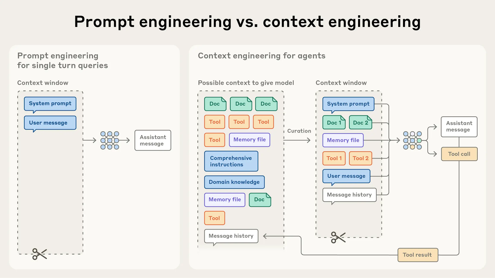
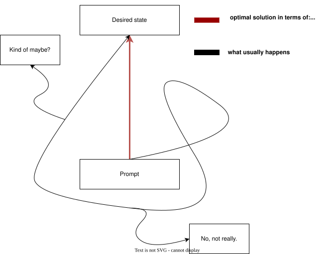
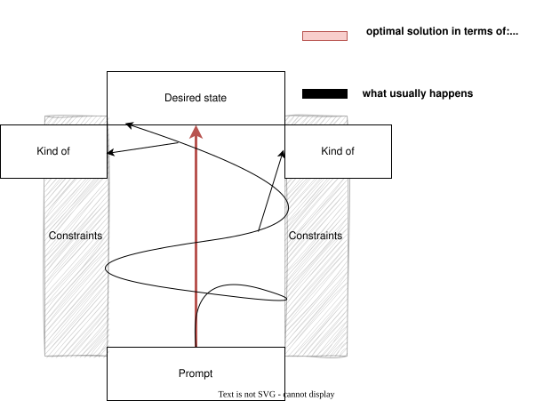
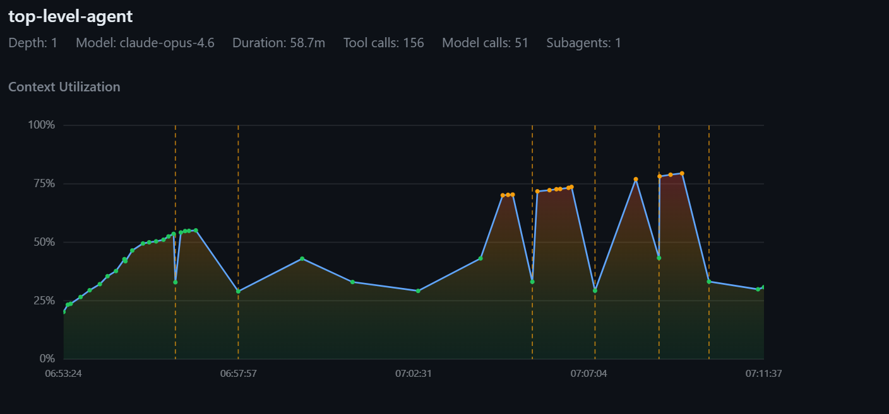
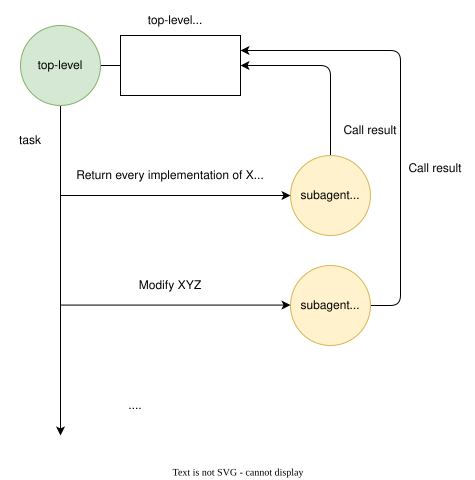

# Coordination mechanisms for long-horizon, self-converging, autonomous LLM systems 

This repository describes and showcases a large language model (LLM) coordination architecture I use to manage long-horizon, self-converging, autonomous tasks.

But primarily, it is here for me to attempt to formalize and formulate some kind of a framework for my thoughts and observations resulting from experimenting with and staring at LLM outputs for way longer than is likely healthy.

A couple of definitions to get started:

> By **long-horizon**, I mean tasks that cannot realistically be completed in one short, uninterrupted reasoning session. They take many tool calls, many intermediate decisions, often multiple phases, and usually some amount of re-evaluation of earlier work. The problem is not just that they are large. It is that they stay large over time, while the model's context keeps changing underneath them, with key information entering and exiting, and the overall system entropy increasing due to inherent constraints and limitation of the LLM architecture.

> By **self-convergence**, I mean that the workflow has an internal mechanism for recognizing that the current result is still not good enough, feeding that back into an earlier stage in its processing, and repeating until some stability condition is reached, or the system hits some explicit bound. In practice, this is usually not some abstract philosophical property, but a loop. For example, a planner produces tasks, execution implements it, verification rejects or flags gaps, and that rejection feeds a replanning pass instead of just becoming a dead-end error that ends the model's turn, prompting human intervention.

> And by **autonomous**, I mean just that. The human bootstraps the environment, prepares some artifacts to drive the workflow -- think task description, references, the final desired state, all that fluff. Then, following this setup, there is only an initial impulse fed into the architecture -- usually a simple *begin*, or *continue* -- after which the system is capable of independent work based on surrounding, self-managed context. It persists through transient API failures, crashes, timeouts, and is capable of resuming from any point without degrading its downstream state and resulting artifacts. It is not dependent on any single ephemeral, transient LLM context.

Table of contents:

- [Coordination mechanisms for long-horizon, self-converging, autonomous LLM systems](#coordination-mechanisms-for-long-horizon-self-converging-autonomous-llm-systems)
- [Primary constraints and assumptions](#primary-constraints-and-assumptions)
- [Problem area introduction](#problem-area-introduction)
  - [Key factors influencing the architecture](#key-factors-influencing-the-architecture)
    - [Harness](#harness)
    - [Context window](#context-window)
    - [Prompt "fragility"](#prompt-fragility)
  - [Imperative vs declarative prompting](#imperative-vs-declarative-prompting)
  - [The LLM "random walk"](#the-llm-random-walk)
- [Agentic workflows](#agentic-workflows)
  - [Single-agent workflow](#single-agent-workflow)
  - [Single-agent + subagent workflows](#single-agent--subagent-workflows)
    - [Conclusion](#conclusion)
- [Context purity](#context-purity)
  - [What it means](#what-it-means)
  - [Why it matters](#why-it-matters)
  - [What changes in practice](#what-changes-in-practice)
  - [Toward treating agents as functions](#toward-treating-agents-as-functions)

# Primary constraints and assumptions

1. I'm a consumer, using consumer-grade tools.
2. I don't have access to hardware that can self-host 1 trillion+ param models.
3. I don't have the manpower to flesh out a ReAct harness from scratch, I'm reusing what's available - Claude Code, Copilot CLI, Codex... build on the shoulders of giants and all that.

So this is basically about how to structure agent workflows on top of existing coding harnesses like Copilot and Claude Code so they can stay coherent over longer runs. That includes how work gets decomposed, how agents hand state to each other, how much context the top-level controller should be allowed to carry, and how to keep the whole system from slowly descending to madness over time.

Copilot and Claude Code style harnesses are basically state of the art ReAct environments. They already know how to search, inspect files, edit code, run commands, recover from errors, and keep a working loop going for a pretty long time.

So the question is not really “can I build a smarter harness”. Most of the time the answer is no, or at least not cheaply.

The more interesting question is: given that these harnesses are already quite good, where do they still break down?

For long-running autonomous work, the answer is usually some combination of context window pressure, compaction behavior, and prompt fragility.

# Problem area introduction

> Skip this section if you're already familiar with these concepts. I'm introducing all of these as constituents of the problem I'm trying to solve. 

## Key factors influencing the architecture

There are a few things pushing the design in this repository.

### Harness

As said above, Copilot and Claude Code are already excellent general-purpose coding loops. That means the architecture here should not fight them. It should use them and the capabilities they provide to solve a different class of problem on top: how to structure long-horizon work so the harness stays effective for longer.

### Context window

This is probably the biggest one.

In a long autonomous session, the model reads files, calls tools, writes code, inspects outputs, thinks through errors, gets redirected, revises plans, (gets sidetracked by the human), and keeps accumulating material in context. Over time, earlier information gets pushed further and further back. Then compaction or summarization kicks in, and now the model is no longer operating over the original material anyway. It is operating over some compressed approximation of it.

A good way to think about this is the following diagram:

 

(image source: https://www.anthropic.com/engineering/effective-context-engineering-for-ai-agents)

That is where a lot of weird behavior comes from.

The model might still look like it “remembers” the task, but the quality of the connections it makes between old constraints and current decisions starts getting worse. Some details survive, others get flattened, and some are just gone. The longer the run, the more this compounds.

### Prompt "fragility"

People often try to fix the above by stuffing more instructions into the prompt. More rules, more workflow steps, more reminders, more reusable snippets, more skills, more agents, more scaffolding, using progressive disclosure. Some of that helps. But there is a limit to how much imperative prompting can really solve. At some point you are just writing a bigger and bigger script and hoping the LLM follows it faithfully across a noisy multi-hour session. That is not a stable foundation. 

Before moving on, I wanna sidetrack with something I see mentioned from time to time in various LLM tutorials, materials, etc., but that never clicked with me until I observed the effects in action, and that is: 

## Imperative vs declarative prompting

Imperative prompting is, I think, the predominant way people interact with LLMs. An imperative prompt often drives the LLM to action:

- do this
- inspect that
- check these files
- debug this issue
- write this output
- compile this
- test that
- summarize what happened

In other words, the prompt is trying to directly control the agent’s action sequence.  

That works fine for shorter human-in-the-loop tasks. The user is around, the scope is bounded, and if the model forgets something you can redirect it.

But in longer workflows, imperative prompting gets brittle very quickly. The prompt is trying to serve as planner, scheduler, guardrail system, memory system, and quality control all at once. It takes one context summarization or memory compaction event to start breaking things down. From an ordered todo list of 10 tasks, the agent can suddenly focus on the latest 1 to 3, finish them, and proudly declare the work done while completely omitting the rest of the workflow.

Declarative prompting starts from a different place. Instead of describing the full sequence of actions, it describes the desired system state `B` given some starting state `A`.

The idea is not “first read this, then do that”. Instead, you give the system a list of declarative statements that are not really meant to induce a specific action sequence by themselves. The prompt contains, essentially, a list of observations:

- here is the source system
- here is the description of the desired state
- here are the constraints
- here is what must be satisfied
- here is what must remain true

And the workflow figures out how to move from one state to the other. You are giving up control over the **how**, the intermediate steps, in exchange for stronger control over the **what**. This is not especially powerful in isolation inside a single-agent system, but it becomes much more interesting once the workflow is no longer dependent on just one context window and one transient memory state.

## The LLM "random walk"

The last aspect of LLM interaction I want to establish before moving to the actual interesting topics is what everyone is likely intimately familiar with.

It looks roughly like this. You start a session, give the agent a prompt, sweat buckets making it as polished and perfect as possible, reference all the skills, link all the docs, cook the meta-instructions to perfection, and yet the end result still often looks something like this:

The prompt produces the initial foundation, but that foundation is brittle and easy to sidestep. The black line is what usually happens: a messy wandering path that sometimes lands somewhere useful, sometimes lands somewhere vaguely correct, and sometimes just drifts off. What we actually want when designing autonomous systems is something closer to:

So what do the constraints that bound the walk actually look like? That depends on the problem domain. In software engineering feature development, they might look like this:

- the project must compile without errors or warnings
- all tests must pass
- the code must follow some engineering guidelines such as proper patterns, abstraction usage, and interface boundaries
- coding style must remain consistent

For project documentation, it gets a lot fuzzier:

- the documentation solution compiles
- persona-centric style and language is maintained
- proper persona-specific documentation is produced
- API examples and code samples follow documentation standards (which often bend clean code standards and patterns in favor of readability)
- the output is structured according to existing semantic and structural preferences
- the output maintains the desired information architecture (diataxis, etc.)

For something like a fantasy book, the constraints get even more abstract:

- the produced artifacts follow genre conventions
- they maintain style and continuity
- they maintain consistent characters, arcs, locations, and events across tens of chapters
- character speech patterns are preserved, and relationship progression is reflected and evolved consistently

As is probably clear, both problem domain and problem scope can very quickly outscale the capabilities of simple agent to subagent workflows as complexity grows.

And that is really the punchline of this section: the harder part is not getting the model to move at all, it is getting it to move while remaining inside a useful constraint envelope. Once the desired state becomes more abstract, more distributed, or more phase-dependent, a single prompt stops being a strong enough bounding mechanism. That is the point where workflow structure starts mattering more than prompt polish, which is exactly where the next section picks up.

# Agentic workflows

## Single-agent workflow

A lot of this architecture starts from a pretty simple observation: a single agent can look surprisingly competent for a while and still be the wrong abstraction for the task. The problem is not that one agent cannot do analysis, planning, writing, review, and verification. It often can -- very well in fact. The problem is that asking the same agent to keep all of that in one continuously growing context creates too many conflicting responsibilities.

The agent has to:

- remember the original goal
- remember the constraints
- remember what it already found
- remember what it already changed
- decide what to do next
- evaluate whether that was correct
- recover from failures
- carry intermediate outputs forward

All of that happens in one thread, inside one context window, while the surrounding information keeps changing.

At first the model is still operating on the actual task. Later it is increasingly operating on its own summaries, partial recollections, and recent local context. The task is still technically the same, but the working representation of it has degraded.

We can observe it in practice by charting compaction events across agent lifetimes. Each event almost guarantees information loss, system entropy, and downstream output degradation. The agent loses sight of previously known facts, task structure, etc.  

(compaction events in a ~58 minute single-agent session)

## Single-agent + subagent workflows

The next obvious move is to split some of that work out into subagents. The intuition makes sense: if one context window is the problem, spawn specialist contexts and let them do narrower pieces of work.

That does help, but only up to a point.

The naive agent to subagent pattern still has a major flaw: the subagent may do its work in an isolated context window, but when it finishes, its findings usually get pushed right back into the main agent's context. So you get temporary isolation during execution, but you do not get a clean handoff model. You just move the context problem one level down and then re-import it into the parent.

That means the main agent still gradually turns into a dumping ground for exploration results, review notes, implementation summaries, and partial findings from multiple child runs. It is better than doing everything in one thread, but it still does not really protect the controller's context purity.

The important detail in this diagram is that both subagent calls eventually feed back into the same top-level context window. So while the subagents may be isolated during execution, the parent still accumulates their outputs and has to reason over the growing aggregate, leading to the same doom loop of compaction -> summarization -> invocation with incomplete information -> task drift.

### Conclusion

The goal is obvious. Move away from LLM context as the place for information flow between agents and subagents, which is where the concept of **context purity** comes into focus.

# Context purity

> Continues from the introduction draft, after the single-agent + subagent section.

The previous sections established three compounding problems:

1. Context windows degrade over time. Compaction and summarization are lossy, and the longer a session runs, the more the agent's working representation of the task drifts from reality.
2. A single agent doing everything accumulates too many responsibilities in one context, and eventually starts operating on its own compressed recollections rather than actual information.
3. Splitting work into subagents helps during execution, but when the subagent finishes, its output gets pushed back into the parent's context. The parent still ends up carrying an ever-growing pile of exploration results, analysis summaries, review notes, and implementation details from every child it ever spawned.

So the problem is not just that one context window is too small. The problem is that the conversation itself is the wrong place to store and pass around the output of a multi-step workflow.

That is what context purity is about.

## What it means

The idea is straightforward: an agent should only carry in its context the information it actually needs for its own job. Not everything the system has ever produced. Not the full output of every subagent it ever called. Just what it needs to make its next decision.

For a top-level agent whose main job is deciding what happens next in a workflow, that means it should not need the complete contents of every sub-task result. It should not be reading ten-page analysis reports just to figure out whether the analysis phase finished successfully. It should not be absorbing full review transcripts just to decide whether to dispatch a rewrite.

What it actually needs is much smaller:

- did the last step finish
- did it succeed, fail, or produce something that needs revision
- what should happen next

Everything else, the detailed analysis, the actual code changes, the review comments, the verification reports, all of that is valuable, but it does not need to live inside the top-level agent's context. It needs to live somewhere the system can access it. Those are different things.

## Why it matters

This is not an aesthetic preference. It is a direct response to the degradation problem.

The top-level agent is the component that survives the longest in any multi-step workflow. It is the one that sees the most transitions, the most subagent returns, the most accumulated state. If that agent is allowed to absorb the full detail of everything that happens underneath it, then it becomes the single biggest target for compaction loss. Every piece of information it carries that it does not actually need is material that will eventually get summarized, distorted, or dropped, and that degrades its ability to make correct decisions later.

Keeping the top-level agent's context clean is not about making the architecture look tidy. It is about making the agent that matters most, the one coordinating the whole run, more resistant to the exact failure mode that makes long sessions unstable.

It also makes the system easier to recover from crashes and failures. If the meaningful state of the workflow is stored externally rather than inside one agent's memory, then restarting that agent does not mean losing the state. The work products are still there. The progress information is still there. The agent can pick up where it left off instead of trying to reconstruct everything from a compacted conversation history.

## What changes in practice

Once this principle is taken seriously, it changes how subagents communicate with the parent.

In the naive model, a subagent does work and returns its findings as text. The parent reads the text, absorbs it, and uses it to decide what to do next. That is the delegation pattern described in the previous section.

Under context purity, the flow changes. The subagent still does work in its own isolated context, but instead of returning the full result to the parent through the conversation, it writes its real output somewhere external, typically the filesystem, and tells the parent only the minimum it needs to know: I finished, here is the outcome category, here is where to find the details if anyone downstream needs them.

The parent never reads the full output. It only reads the short completion signal. Downstream agents that actually need the detailed output read it directly from the filesystem, not from the parent's retelling of it.

That is the key structural change. Information still flows through the system, but it flows through files rather than through one agent's context window. The parent stays lean. The detailed work products stay intact. And no intermediate summarization step is needed because each downstream agent reads the original, not a compressed copy.

## Toward treating agents as functions

This naturally leads to a different way of thinking about what a subagent is.

In the naive model, a subagent is something you talk to. You give it a task, it does work, and it talks back. The conversation is the interface.

Under context purity, that conversational interface becomes a liability, because every word that comes back adds to the parent's context load. So the question becomes: what is the minimum interface between a parent and a child agent that still lets the system work?

The answer turns out to look a lot like a function call.

The parent provides a small input: what to do, maybe what to read, maybe some constraints. The child runs, does its work, writes its output externally, and returns a short structured signal. The parent uses that signal to decide the next step. It never touches the actual output.

This is **agent-as-function**. Literally. The agent <-> subagent interface is treated as a function with a defined input, a defined output location, and a bounded return value. The parent calls it, waits for the return, and routes based on the result. The substantive data flows outside the conversation entirely. The parent context window effectivelly becomes a callstack.

