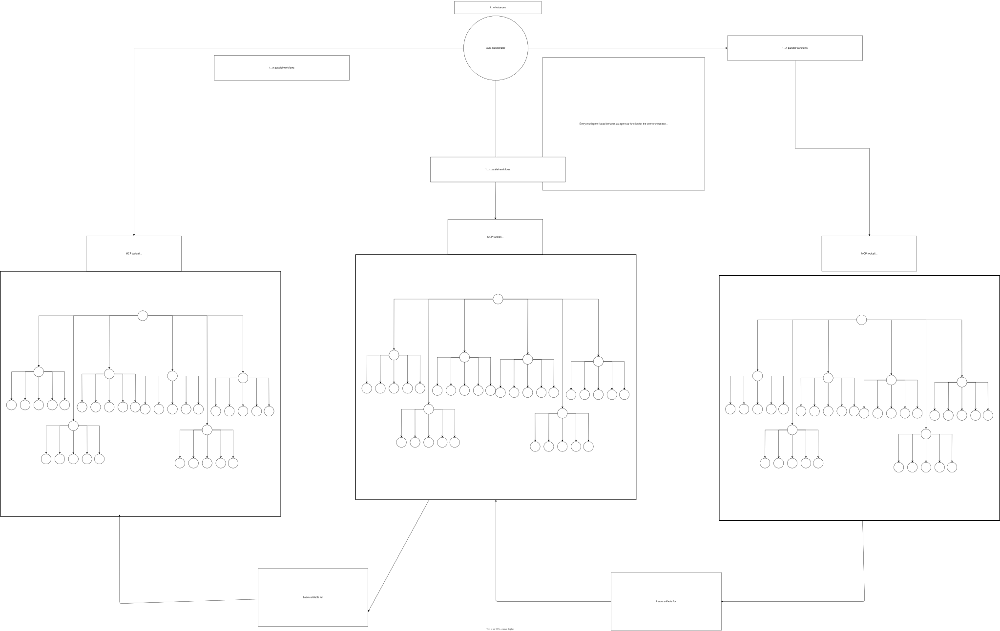

problem statement

Introduction stuff - single agent workflow limitations

determinism issues

- mental model => building a wall to constraint the LLM random walk

- obvious approaches

context window + compaction events
- biggest contributors to nondeterminism, degraded output quality
harness quality
- prompts/instruction files/skills/agents (sub-system instructions)

Multiagent workflows (within a single harness - copilot cli)

coordinating agent->subagent workflows

context purity

agent-as-function

concept of orchestrator -> specialist

intermediate artifacts as a method of coordination
- initial exploration
- problem/task analysis
- planning -> task graph (structured data - json/sql vs markdown)


generalizations to multiple nesting levels

- self-convergence

- orchestrator -> coordinator -> subcoordinator -> specialist

- pyramid of purity/abstraction
    - pure router vs task-driven subagents
    - progressive disclosure/problem domain exposure
- declarative vs imperative prompting
    - no read this, do that
    - describe desired system state and let the workflow figure out the constraints itself

Example of declarative prompting for a multiagent migration system.

```json
{
  "source": {
    "codePath": "<somePath>",
    "appUrl": "http://localhost:3000",
    "notes": "Jekyll site with Ruby plugins, custom Liquid tags, LESS+Tailwind hybrid CSS, Algolia search (frontend+backend indexing), RSS/sitemap custom generators, Learn Portal with localStorage client logic"
  },
  "target": {
    "framework": "NextJS 16 + App Router, following modern web dev practices. Tailwind 4 for styles, TypeScript for business logic.",
    "outputDirectory": "<somePath>",
    "testFramework": "Vitest and Playwright, basically the default Next stack",
    "notes": "The repository is a Frankenstein monstrum of NodeJS, Ruby, Jekyll, many Jekyll customizations, LESS, Tailwind 4, vanilla JavaScript, Algolia frontend and backend libraries and many other odds and ends - RSS/Sitemap generation, including custom generators"
  },
  "constraints": [
    "Nginx reverse proxy must stay as is even for the Next site.",
    "Every converted chunk must follow latest 2026 nextjs webapp best practices, correlated with internet sources",
    "The nextjs app must comply with latest security practices. Each implementation decision correlated against corresponding trusted internet sources such as OWASP",
    "All user flows on the live site must be tested using playwright and verified",
    "Each landing page, layout, must have a screenshot from the source app and the target app, proving that the migration maintained identical styling and layout, saved under .migration/screenshots/<area>",
    "Learn Portal client logic currently wires localstorage everywhere -> must go against an interface to swap out storage for Prisma in the future.",
    "All markdown documentation content must be migrated to MDX.",
    "Docsassets folder that contains assets consumed documentation pages must be migrated as well",
    "CompositePages functionality must be preserved",
    "Azure deployment and ADO pipelines must stay, just adapted to NextJS requirements",
    "All third party integrations must work exactly as they do in the source.",
    "All CSS must be rewritten to Tailwind 4, following best practices from early 2026, correlated against internet sources",
    "All migrated code must satisfy latest 2026 best practices",
    "Liquid tags must directly convert to MDX components",
    "All tests unit/integration/e2e tests from rspec/nunit must migrate to Vitest and Playwright and pass",
    "The config-based build configuration should be preserved or migrated to a similar pattern",
    "All existing vanilla JS modules must be rewritted to TS and React components.",
    "Feature parity 1:1 including all user flows.",
    "Every implemented flow must be tested via playwright."
  ]
}
```

fractal multiagent systems 

- progressive disclosure

- 

## Further generalization

This is where the fractal part of the name finally shows up. Take any single fractal workflow, hide it behind an MCP call, or add another orchestration layer, and you get:



At this point, the only thing you are realistically bounded by are invocation cost and available hardware. Every decomposable workflow can be emulated using this architecture, provided the input/output contract between the fractal families is well-curated and structured.

## Remarks

### Routing tables

Orchestrators, coordinators, and subcoordinators in this architectural demo use simple markdown-based routing tables embedded in their prompts. For example, take the *migration* orchestrator:

```md
| Condition | Action |
|---|---|
| No coordinator status files exist | Dispatch `migration-discovery-coordinator` |
| Discovery result = `mapped` | Dispatch `migration-planning-coordinator` (it runs Pass 2 first) |
| Planning result = `deepened` | Planning coordinator continues to Pass 3 automatically |
| Planning result = `planned` | Dispatch `migration-execution-coordinator` |
| Execution result = `implemented` for a slice | Dispatch `migration-verification-coordinator` in inline mode for that slice |
| Verification result = `verified` for a slice | Return to execution-coordinator for next slice |
| Verification result = `failed-parity` | Re-dispatch `migration-execution-coordinator` for that slice |
| All slices verified or blocked | Dispatch `migration-verification-coordinator` in gap-hunting mode |
| Gap-hunting result = `uncovered-gap` with items needing analysis | Re-enter Pass 2: dispatch `migration-planning-coordinator` |
| Gap-hunting result = `uncovered-gap` with items ready to plan | Re-enter Pass 3: dispatch `migration-planning-coordinator` |
| Gap-hunting result = `verified` (nothing new found) | Dispatch `migration-delivery-coordinator` |
| Any coordinator result = `blocked` or `escalated` | Stop and report to user |
| Delivery result = `delivered` | Migration complete — report to user |
```

Since LLMs are overall well-grounded in markdown-based content, this is not that big of an issue, but I would like to experiment with a more formalized way of integrating these systems together. Maybe something like a transition functions from formal language theory?

What you probably don't want to in this case is introduce a completely novel concept that the LLM would need to waste thinking time and tokens to understand (possibly extending the entire workflow by hours in complex systems, and costing more overall). Rather, take the most compact method which the LLMs is familiar with to a sufficient degree from its training data, and use that.
